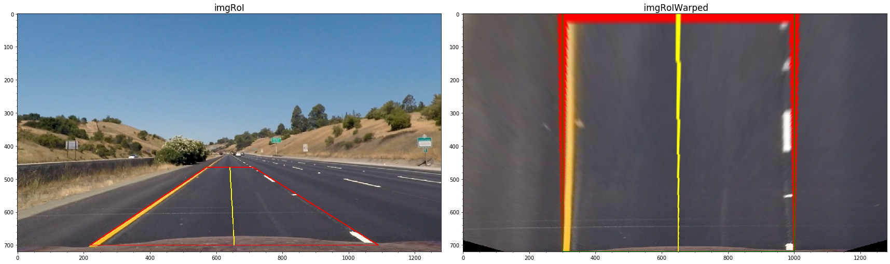

 
 
<!-- markdownlint-disable MD033 -->
<!-- <head> -->
<link rel="stylesheet"  href="markdown_styles.css">
<!-- </head> -->
<!-- @import "css/markdown-styles.css" -->
<!-- @import "/css/main.css" -->
<!-- (setq markdown-xhtml-header-content) -->


# Advanced Lane Finding Project
### Project 2 - Udacity Self Driving Car Nanodegree 
#### Kevin Bardool

---

The goals / steps of this project are the following:

* Compute the camera calibration matrix and distortion coefficients given a set of chessboard images.
* Apply a distortion correction to raw images.
* Use color transforms, gradients, etc., to create a thresholded binary image.
* Apply a perspective transform to rectify binary image ("birds-eye view").
* Detect lane pixels and fit to find the lane boundary.
* Determine the curvature of the lane and vehicle position with respect to center.
* Warp the detected lane boundaries back onto the original image.
* Output visual display of the lane boundaries and numerical estimation of lane curvature and vehicle position.

---
The goals / steps of this writeup: 

 Address the project specifications/requirements as laid out in the [Rubric Points](https://review.udacity.com/#!/rubrics/571/view) :
* Writeup / Readme 
* [Camera Calibration : ](#camera-calibration) Review of the camera calibration process:  
* [Image Pipeline : ](#lane-detection-pipeline-single-images) Review of the detection pipeline for images 
* [Video Pipeline : ](#lane-detection-pipeline-video)Review of the detection pipeline for videos 
* [Discussion : ](#Discussion) Reflection on work, challenges encountered, and  possible improvements. 
---

[//]: # (Image References)
<!-- [image1]: ./examples/undistort_output.png "Undistorted"
[image2]: ./test_images/test1.jpg "Road Transformed"
[image3]: ./examples/binary_combo_example.jpg "Binary Example"
[image4]: ./examples/warped_straight_lines.jpg "Warp Example"
[image5]: ./examples/color_fit_lines.jpg "Fit Visual"
[image6]: ./examples/example_output.jpg "Output"
[video1]: ./project_video.mp4 "Video"
[image01]: ./camera_cal/calibration1.jpg "calibration1 image"
[image02]: ./camera_cal/calibration4.jpg "calibration4"
[image03]: ./camera_cal/calibration5.jpg "calibration5"
[image04]: ./writeup_images/detectcorners2.png "detectcorner2"
[image05]: ./writeup_images/detectcorners3.png "detectcorner3"
[image06]: ./writeup_images/undistorted2.png "undistorted2"
[image07]: ./writeup_images/undistorted3.png "undistorted3" -->


 
## Camera Calibration
<br>

**1. Briefly state how you computed the camera matrix and distortion coefficients.**

Classes `Camera` and `CalibrationImage` were implemented for the camera and calibration images respectively. Code for these classes are located in `./classes/camera.py` and `./classes/image.py`
 
The code for this step is contained in the first code cell of the IPython notebook located in "./1-CameraCalebration.ipynb".  

For each chessboard calibration image, an instance of the `CalibrationImage` is instantiated, and its `findChessboardCorners()` method is called. This function is basically a wrapper for the `cv2.findChessboardCorners()`  also accepting `nx` and `ny` parameters that specify the chessboard dimensions. This allows changing the number of inside corners based on the individual calibration image.

This method prepares the  `objectPts` numpy array which contains the (x, y, z) coordinates of the chessboard corners in the real world (assuming the chessboard is fixed on the (x, y) plane at z=0).  The result of the corner detection, `imagePts`, is a `[nx, ny]` array of the (x, y) pixel position of each of the successfully detected corners in the chessboard image plane.

### Examples of successful corner detections:
 


### Corner detection failures
<br>
When running the detection process for all calibration images using parameters `(nx,ny) = (9,6)` we observe that the corner detection fails for `calibration1.jpg`, `calibration4.jpg`, and `calibration5.jpg`.

The openCV documentation states:
>The function requires white space (like a square-thick border, the wider the better) around the board to make the detection more robust in various environments. Otherwise, if there is no border and the background is dark, the outer black squares cannot be segmented properly and so the square grouping and ordering algorithm fails.

The three failed images are all missing a sufficient white border on two or more sides of the chessboard:

<p align="center">


</p>


It is possible to successfully run corner detection on these images when the `(nx,ny)` parameters are adjusted. For the purposes of this project however I have only included images that 

Image objects that successfully pass the corner detection process are saved in a list that is passed to the `camera.calibrate()` method. This method passes real world points `image.objPoints` and the equivalent image coordinates `image.imgPoints`  to compute the camera's calibration matrix and distortion coefficients as well as the rotation/translation vectors for each image).
 
Once the camera calibration matrix has been calculated, it is possible to undistort images - two examples of undistorted images are shown below:


 

<p align="center">Example of distortion-correction. Left: Original Image &nbsp  Right: Undistorted Image </p>

<br>
<br> 

## Lane Detection Pipeline (single images)
<br>

### 1. Provide an example of a distortion-corrected image.


<figure>


<p align="center">Example of distortion-correction. &nbsp &nbsp Left: Original Image &nbsp &nbsp  Right: Undistorted Image</p>
</figure>
<br>
<br>

### 2. Describe how (and identify where in your code) you used color transforms, gradients or other methods to create a thresholded binary image.  Provide an example of a binary image result.  

A number of thresholding methods were implemented and experimented with in order to select a robust thresholded binary image that will work for most lighting combinations. 

*   X and Y Gradient 
*   Gradient Magnitude and Threshold
*   RGB Channel Thresholds (Channel AND and OR) 
*   Hue Thresholding (on image HLS format)
*   Level Thresholding (on image HLS format)
*   Saturation Thresholding (on image HLS format)

The code for these various thresholding methods can be found in <code class=redcode>./common/sobel.py</code>. I experimented with a number of other methods such as erosion, dilation, opening and closing however did not find them to improve the thresholding process significantly. 

<figure>

<p align="center">Example of various thresholding operations</p>
<figure>
<br>

To create the final thresholded image, we experimented creating a **compound** binary threshold image by combining various individual threshold operations. Eventually a combination of X Gradient, Gradient magnitude and direction, Saturation, and RGB levels was selected with the following threshold limits:

|  Point Location  |   Thresholding Limits (Min/Max)|
|:----------------:|:------------------------------:|
|  X Gradient      |  (30, 110)  |
|  Gradient Magnitude |  (65, 255)  |
|  Gradient Direction |  (40, 65)   (slope in degrees)  |
|  Saturation      |  (200,255)  |
|  RGB Levels      |  (210, 255) |

<br>
Images below demonstrate various combinations of compound binary thresholding operations.
<br>


<p align="center">Example of compound binary thresholds </p>
<br>

<p align="center">Binary thresholding using compound thresholds on RGB, saturation and gradient magnitude</p>
<br>


### 3. Describe how (and identify where in your code) you performed a perspective transform and provide an example of a transformed image.

Perspective transformation is done in <code class=redcode>perspectiveTransform()</code> located in `./common/sobel.py` lines 18 to 28.  `perspectiveTransform()` takes receives source (`source`) and destination (`dest`) points, and the image to transform. It first calls `cv2.getPerspectiveTransform()` to obtain the transformation matrix `M`. Next, it calls `cv2.warpPerspective()` to apply the perspective transformation on the input image using the calculated transformation matrix.   


The exact coordinates of source and destination points used for the transformation were selected through a review of a number of test images, aiming to convert the converging lane lines to parallel lines post transformation. 

We ended up using the following source and destination points:

|  Point Location  |   Source    | Destination  | 
|:----------------:|:-----------:|:------------:| 
|  Top Left        |  570, 465   |  300, 0      | 
|  Top Right       |  714, 465   | 1000, 0      |
|  Bottom Right    | 1090, 700   | 960, 719     |
|  Bottom Left     |  220, 700   | 960, 719     |

The perspective transform was tested` by drawing the `src` and `dst` points onto a test image and its warped counterpart to verify that the lines appear parallel in the warped image.



<p align="center">Example of perspective transformation</p>
<br>

### 4. Describe how (and identify where in your code) you identified lane-line pixels and fit their positions with a polynomial?

<code class=redcode>sliding _window_detection_v1()</code> is the routine responsible for lane-pixel identification. This code is located `common/utils.py`, lines 1155-1325.  This routine first generates a histogram of active pixels in the lower 1/3rd of the thresholded image, detects the peak positions (counting the pixels per x position) and finds the x location corresponding to the peak positions located on the left and right of the x-axis midline.

 

<p align="center">Detecting activated pixels using histogram on the lower portion of the image.
<br>
<br>

The \(X_{left}\) and \(X_{right}\) positions are used as starting points in the sliding window algorithm we use to search for left and right lane pixels. The first windows are centered at \(X_{left}\) and \(X_{right}\), respectively. For each window, the non-zero pixels located within the window region are selected and counted.

```python
# Identify the nonzero pixels in x and y within each window.nonzerox and nonzeroy are the x,y # 
# coordiantes of all non-zero pixels in the binary thresholded image. 
left_x_inds = np.where((win_xleft_low <=  nonzerox) & (nonzerox < win_xleft_high))
left_y_inds = np.where((win_y_low     <=  nonzeroy) & (nonzeroy < win_y_high))
good_left_inds = np.intersect1d(left_x_inds,left_y_inds,assume_unique=False)

right_x_inds = np.where((win_xright_low <= nonzerox) & (nonzerox < win_xright_high))
right_y_inds = np.where((win_y_low     <=  nonzeroy) & (nonzeroy < win_y_high))
good_right_inds = np.intersect1d(right_x_inds,right_y_inds,assume_unique=False)
###------------------------------------------------------------------------------------
``` 

If the number of detected pixels within a window region is less than the `minpix` parameter, it is assumed that pixel detection for that window has failed. In this case the center position of the current window is reused for the next window iteration. Otherwise, detected pixels are appended to a list for further processing.

 An example of the sliding window process and detected lane pixels on the binary thresholded image is displayed below:


<p align="center">Example of lane pixel detection using the sliding window algorithm</p>
<br>
 
The X and Y coordinates of the selected pixels (red and blue pixels in image above) are the passed on to the line fitting process, <code class=redcode>fit_polynomial_v1</code> ( `common/utils.py`, lines 347-361). This routine calls `np.polyfit` to fit a second degree polynomial over the detected pixels. 


<p align="center">Example of lane pixel detection and fitted polynomials</p>
<br>

### 5. Describe how (and identify where in your code) you calculated the radius of curvature of the lane and the position of the vehicle with respect to center.

For lane detection on images, radius of curvature calculation is performed in  <code class=redcode>calculate_radius()</code> ( `common/utils.py`, lines 720-728):

```
def calculate_radius(y_eval, fit_coeffs, units, MX_denom = 700, MY_denom = 720, debug = False):
    MY = 30/MY_denom # meters per pixel in y dimension
    MX= 3.7/MX_denom # meters per pixel in x dimension
    A,B,_ = fit_coeffs   
    if units == 'm':
        A = (A * MX)/ (MY**2)
        B = (B * MX/MY)
    
    return  ((1 + ((2*A*(y_eval*MY))+B)**2)** 1.5)/np.absolute(2*A) 
```

The curvature message displayed on the image is build in  <code class=redcode>curvatureMsg_V1()</code> ( `common/utils.py`, lines 730-745)

The off-center calculation and message generation is done in  <code class=redcode>offCenterMsg_V1()</code> ( `common/utils.py`, lines 763-797)


### 6. Provide an example image of your result plotted back down onto the road such that the lane area is identified clearly.

The code to plot / overlay the detected lanes back onto the image is implemented in <code class=redcode>displayDetectedRegion_v1()</code> ( `common/utils.py`, lines 657-707). The necessary overlay is constructed and added to the input image using `cv2.addWeighted()` function.  

<br>
<p align="center">


<br>
Results of lane detection over images test1 - test3
<br>
<br>


<br>
Results of lane detection over images test5 - test6
<br><br>


<br>
Results of lane detection over images test5 - test6
<br>
<br>
</p>
</div>

## Lane Detection Pipeline (video)

For the video stream lane detection, I started from the code base for image lane detection. A significant number of modifications and enhancements were made to the software. A detailed explanation of all enhancements would be beyond the brevity requirements of this report, so I will only discuss the most important points:


### New Class Definitions:
- `VideoPipeline`: Pipeline class for video input. 
- `Line` class instantiated for left/right lane detection. Manage fitted polynomial attributes and methods during the video frame lanes detection process.
- `VideoFile` used to manage input/output video files. Instantiated twice per pipeline execution, for input and output files, respectively.

- Many of the functions written for the image lane detection were reimplemented to support the new classes.

- A series of "debug helpers" were written to tracking, verification, and troubleshooting purposes. 

- A series of visualization helpers were written to research the video frame characteristics for dynamic frame thresholding. For example the Hue, Level, and Saturation rates of individual video frames (more below). 

### Dynamic Frame Thresholding

 For binary thresholding of individual video frames, a dynamic thresholding approach was taken. Instead of a static thresholding method, the thresholding method used in each frame is determined based on the mean RGB and  average values of each frame extracted from the RGB and HLS images.

Here are the frame conditions, selection criteria, and the corresponding thresholding method for the project video. It is important to note that the original frame condition process was quite simple and consisted three conditions: `dark`, `low-saturation` and `normal`. As I worked on the more challenging videos encompassing a larger variety of lighting conditions, the selection process was expanded. 

As a frame is categorized, its corresponding thresholding method is applied and used for subsequent pipeline steps.  

|  Frame Condition   |  Mean RGB       | Saturation   | Binary Thresholding Method |
|:-------------------|:----------------:|:------------:|:-------------------:| 
|  X-High Saturation |    ---          | Sat >  120   |  magnitude / x gradient |  
|  High Saturation   |    ---          | Sat >  65    |  magnitude / x gradient |  
|  Low  Saturation   |    ---          | Sat <  20    |  hue / x gradient |  
|||||
|  X-High Mean RGB   |    RGB  > 180   |   ---        |  magnitude / x gradient |  
|  High / Med        | 100< RGB < 180  | 20< Sat < 65 |  RGB / Level / Saturation | 
|  Low               | 35 < RGB < 100  | 20< Sat < 65 |  magnitude / xy gradient | 
|  X-Low             | RGB  < 35       | 20< Sat < 65 |  magnitude / xy gradient |  


A wide variety of video frame color space statistics were investigated in order to select the proper thresholds and the corresponding binary thresholding method. Here is a sample plot from one of these experiments that plots the Hue, Level, Saturation, and Mean RGB of each frame of video clip.


<p align="center">


<br>
Video analysis plots. Top: Undistorted frames  - Bottom: Frames after perspective transformation
<br>
<br>
</p>


### Assessment of detected lane pixels
`assess_lane_detections()` (lines 412-532 of `classes/videopipeline.py`) assesses the detected non-zero pixels detected in the binary thresholded image. It examines counts and ratios of the overall image as well as individual status for pixels detected for each lane.

#### Lane-level assessments:
- absolute count of non-zero pixels detected for each lane
- ratio of detected non-zero pixels to total pixels in lane search region

#### Frame-level checks:
- ratio of non-zero pixels to total pixels in image 
- ratio of detected non-zero pixels to total non-zero pixels in image 
- ratio of detected non-zero pixels to total non-zero pixels in search regions 
- number of non-zero pixels detected in lane search region to total number of 

These allow us to determine whether the detected pixel are reliable enough to use the fitted polynomals for lane detection. For example, if the image is over saturated, the ratio of non-zero pixels to total pixels and lane non-zero pixels to lane search pixels will be extremely high, and as a result the fitted polynomials cannot be relied upon.

<p align="center">

<br>
Pixel ratio analysis of video frames
<br><br>
</p>


### Assessment of Fitted Polynomials
`assess_fitted_polynomials()` (lines 536-532 of classes/videopipeline.py) takes results of the detected pixels assessment (above) and other information related to the frame being processed, and makes a final determination whether to accept or reject the fitted polynomials. 

Based on the quality of the detected pixels in the image and fitted polynomials, the color of the inter-lane overlay is set to green, yellow, or red. 

- Green: frame produced acceptable detection pixels  and both lane polynomials were accepted. 
- Yellow: detection has low quality ( one or more polynomials were rejected or the frame detection has poor quality) 
- Red : We have encountered low quality lane detection for more than 25 frames. 
- no-display: no reliable lane detection could be ascertained. 

Examples of these overlays can be seen in the hard challenge video output.

### Dynamic adjustment of perspective transformation points
Another part that was added during the work on the harder challenge video was the dynamic change of perspective transformation points. As we encounter curves in the road, the points selected for the perspective transformation drift away from the lanes we aim to detect, and we end up detecting other artifacts. To address this I implemented dynamic realignment of the perspective transformation points. This code for this is in `adjust_RoI_window` (lines 800-900 in ./classes/videopipeline.py).  

After each reliable lane detection we taken the top and bottom points on each lane and calculate the difference between them and the perspective transformation points. If the horizontal difference (along x axis) is larger than a preset threshold (`OFF_CENTER_ROI_THRESHOLD`) we adjust the source transformation points. This will be applied on the next and subsequent frames. Since we adjust the perspective transformation, we also set a flag to apply the sliding window detection algorithm on the next video frame. 

 <br>
 <br>
 <br>

 ### 1. Provide a link to your final video output.  Your pipeline should perform reasonably well on the entire project video (wobbly lines are ok but no catastrophic failures that would cause the car to drive off the road!).


- [Project Video](https://youtu.be/zuZbICpFCIo)


<p align="center">
  <a href="https://www.youtube.com/watch?v=zuZbICpFCIo"></a>
</p>


- [Challenge Video](https://youtu.be/RgM5bsvKJNM)

<p align="center">
  <a href="https://www.youtube.com/watch?v=RgM5bsvKJNM"></a>
</p>


- [Hardest Challenge video](https://youtu.be/RgM5bsvKJNM)

<p align="center">
  <a href="https://www.youtube.com/watch?v=RgM5bsvKJNM"></a>
</p>


## Discussion

### 1. Briefly discuss any problems / issues you faced in your implementation of this project.  Where will your pipeline likely fail?  What could you do to make it more robust?

Here I'll talk about the approach I took, what techniques I used, what worked and why, where the pipeline might fail and how I might improve it if I were going to pursue this project further.  
