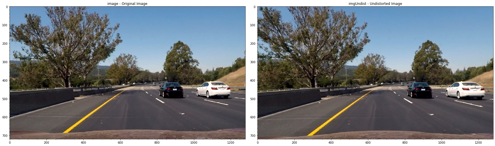
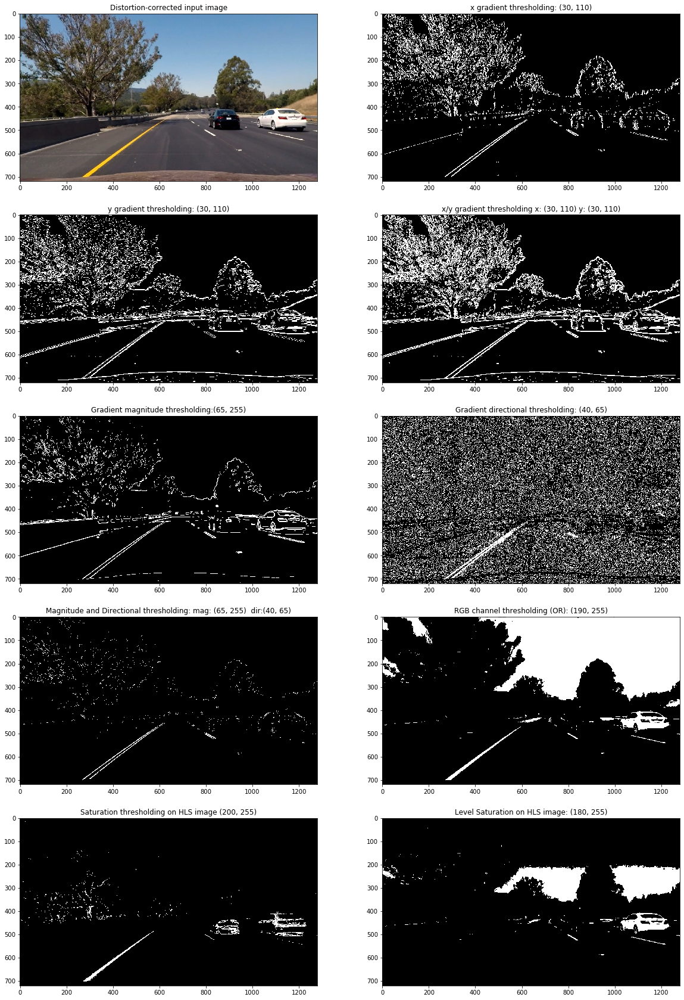
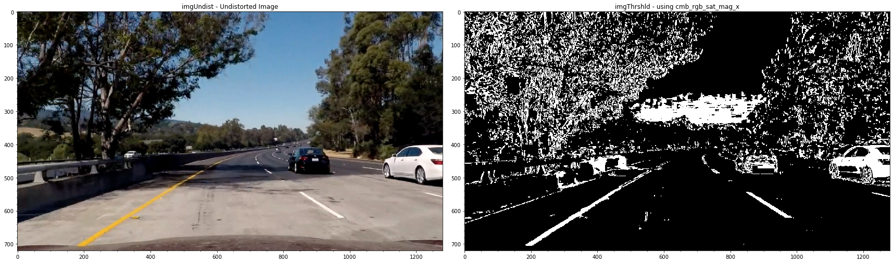
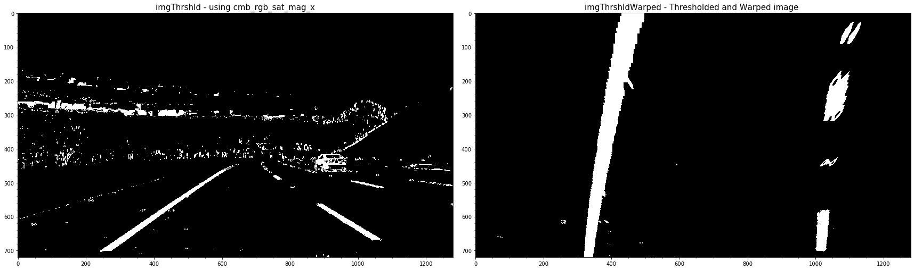
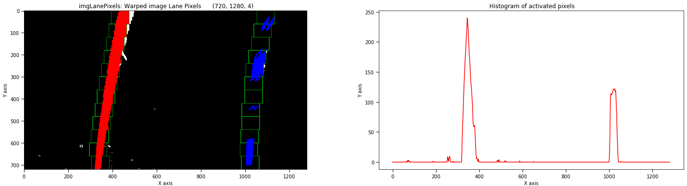
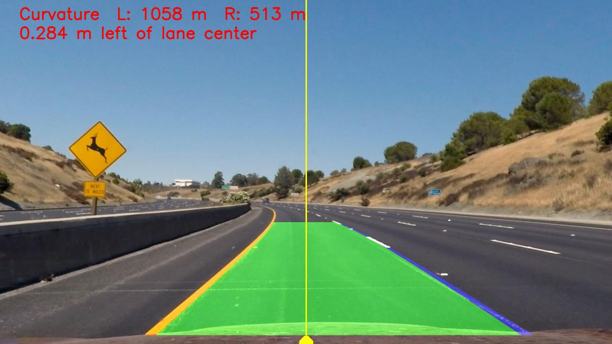
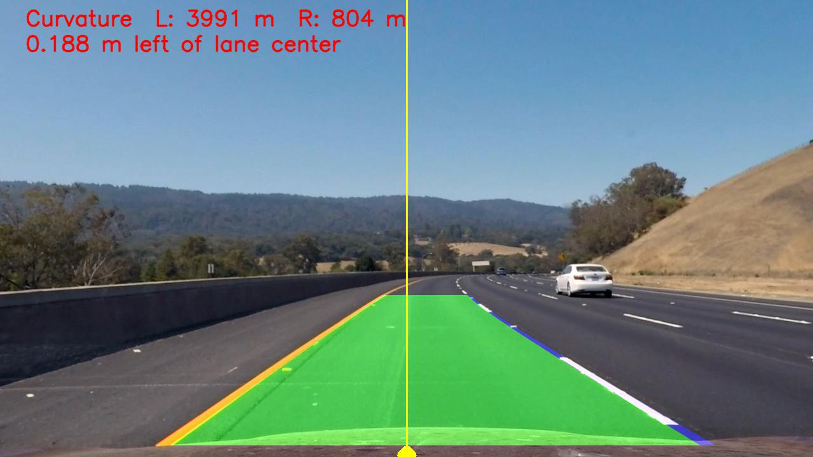
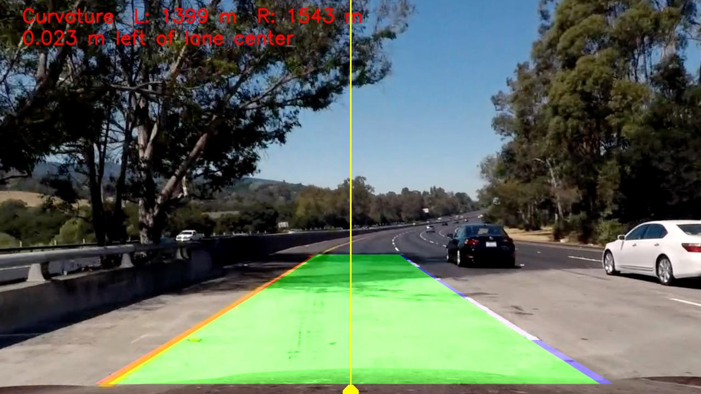
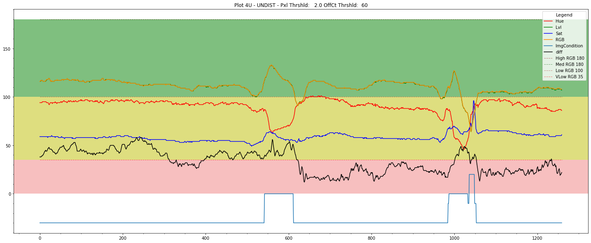
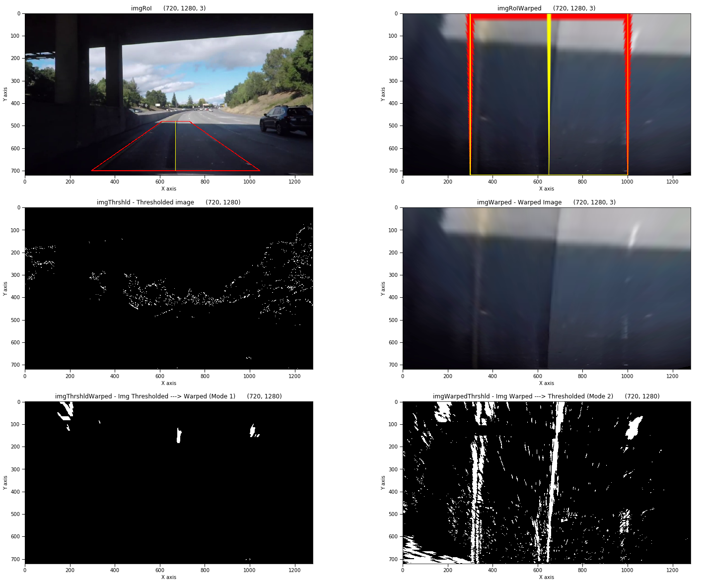

 
 
<!-- markdownlint-disable MD033 -->
<!-- <head> -->
<link rel="stylesheet"  href="markdown_styles.css">
<!-- </head> -->
<!-- @import "writeup_images/css/markdown-styles.css" -->
<!-- @import "writeup_images/css/main.css" -->
<!-- (setq markdown-xhtml-header-content) -->


# Advanced Lane Finding Project
### Project 2 - Udacity Self Driving Car Nanodegree 
#### Kevin Bardool

---

#### Project Goals:

* Compute the camera calibration matrix and distortion coefficients given a set of chessboard images.
* Apply a distortion correction to raw images.
* Use color transforms, gradients, etc., to create a thresholded binary image.
* Apply a perspective transform to rectify binary image ("birds-eye view").
* Detect lane pixels and fit to find the lane boundary.
* Determine the curvature of the lane and vehicle position with respect to center.
* Warp the detected lane boundaries back onto the original image.
* Output visual display of the lane boundaries and numerical estimation of lane curvature and vehicle position.

---

#### Contents:
This writeup addresses the project specifications/requirements as laid out in the [Rubric Points](https://review.udacity.com/#!/rubrics/571/view) :

* [Camera Calibration : ](#1-camera-calibration) Review of the camera calibration process:  
* [Image Pipeline : ](#2-lane-detection-pipeline-single-images) Review of the detection pipeline for images 
* [Video Pipeline : ](#3-lane-detection-pipeline-video)Review of the detection pipeline for videos 
* [Discussion : ](#4-discussion) Reflection on work, challenges encountered, and  possible improvements.
* [Appendix : ](#appendicies) Contains supplementary information.

---


## 1. Camera Calibration

### 1.1 Corner Detection

Classes `Camera` and `CalibrationImage` were implemented for the camera and calibration images respectively. Code for these classes are located in `./classes/camera.py` and `./classes/image.py`
 
For each chessboard calibration image, an instance of the `CalibrationImage` is instantiated, and its `findChessboardCorners()` method is called. This function is basically a wrapper around the [cv2.findChessboardCorners()](https://docs.opencv.org/4.1.1/d9/d0c/group__calib3d.html#ga93efa9b0aa890de240ca32b11253dd4a), which allows us to do additional processing on `CalibrationImage` objects.

When corner detection is successful, `cv2.findChessboardCorners()`, returns `imagePts` a  `(nx * ny)` array of the (x, y) pixel positions of the successfully detected inner corners on the chessboard image plane. 
 
Our `findChessboardCorners()` wrapper also prepares the `objectPts` numpy array, which contains the 3D coordinates of the chessboard corners in the real world, with z = 0 since the chessboard is on a flat image plane (z = 0).  assuming the chessboard is fixed on the (x, y) plane at z=0 (e.g.:  [(0,0,0), (1,0,0), (2,0,0) ....,(6,5,0)] ). 

The successfully corner-detected image is added appended to a list of `CalibrationImage` objects that will be  used for camera calibration.   

The code demonstrating the corner detection and computing the camera calibration parameters can be found in the `1-CameraCalibration` notebook.


#### Examples of successful corner detections:
 


#### Corner detection failures

The corner detection process is applied to all chessboard images using the parameters `(nx,ny) = (9,6)` (number of horizontal and vertical corners). However, we observe that the corner detection fails on three chessboard images: `calibration1.jpg`, `calibration4.jpg`, and `calibration5.jpg`.

The [openCV documentation](https://docs.opencv.org/4.1.1/d9/d0c/group__calib3d.html#ga93efa9b0aa890de240ca32b11253dd4a) states:
>The function requires white space (like a square-thick border, the wider the better) around the board to make the detection more robust in various environments. Otherwise, if there is no border and the background is dark, the outer black squares cannot be segmented properly and so the square grouping and ordering algorithm fails.

The three failed images are all missing a sufficient white border on two or more sides of the chessboard:
<br>
<p align="center">


</p>
<p align="center">Chessboard images with failed corner detection  from Left: calibration1, calibration4, and calibration5.</p>
<br>

It is possible to successfully run corner detection on these images when the `(nx,ny)` parameters are adjusted. For example, we can successfully detect corners for calibration5.png when we set (nx, ny) to (7, 6), as illustrated below: 

<br>
<p align="center">

</p>
<p align="center">Successful corner detection on <code>calibration5.jpg</code> when  (nx, ny) are set to (7,6)</p>
<br>


For the purposes of this project, we only include images in the calibration process that pass the corner detection process with (nx, ny) = (9, 6).

###  1.2 Camera Calibration

`CalibrationImage` objects that successfully pass the corner detection process are appended to a list and passed to the `Camera.calibrate()` method. This method receives real world points `image.objPoints`, and the equivalent image coordinates `image.imgPoints`, and calls [cv2.calibrateCamera](https://docs.opencv.org/4.1.1/d9/d0c/group__calib3d.html#ga3207604e4b1a1758aa66acb6ed5aa65d) to compute the camera's calibration matrix and distortion coefficients as well as the rotation/translation vectors for each image. The camera calibration parameters are saved in a pickle file for future reference. 
 
Once the camera calibration matrix has been calculated, it is possible to undistort images using the `Camera.undistortImage()` method. Two examples of images before and after the distortion correction are shown below:


 

<p align="center">Example of distortion correction. &nbsp Left column: Original Images 
&nbsp &nbsp Right: Undistorted Image </p>

[Back to Top](#advanced-lane-finding-project)

## 2. Lane Detection Pipeline (single images)

For the lane detection on images, we define the `ImagePipeline` class (in `classes/imagepipeline.py`). The pipeline receives a `Camera` instance as its input, which contains the parameters for the camera installed on the vehicle. 

#### 2.1. Provide an example of a distortion-corrected image.

To apply distortion correction, the `undistortImage()` method of the camera object is invoked.

```python
        ###----------------------------------------------------------------------------------------------
        ###  Remove camera distortion and apply perspective transformation
        ###----------------------------------------------------------------------------------------------
        imgUndist = self.camera.undistortImage(imgInput)
```

<figure>


<p align="center">&nbsp &nbsp  Example of distortion-correction.<br> &nbsp &nbsp Left column: Original Image &nbsp &nbsp  Right column: Undistorted Image</p>
</figure>
<br>
<br>

#### 2.2. Describe how (and identify where in your code) you used color transforms, gradients or other methods to create a thresholded binary image.  

In order to select a robust binary-thresholded  image that would work for most lighting combinations, a wide variety of thresholding methods and other image manipulation operations  were implemented and experimented with. These included:

*   X and Y Gradient : `grad_x_thresh() , grad_y_thresh()`
*   Gradient Magnitude and Direction :  `grad_mag_thresh(), grad_dir_thresh()`
*   RGB Channel Thresholds (channel-wise AND and OR) : `RGB_AND_thresh(), RGB_OR_thresh()`
*   Hue Thresholding (on image HLS format) : `hue_thresh()`
*   Level Thresholding (on image HLS format) : `level_thresh()`
*   Saturation Thresholding (on image HLS format) : `saturation_thresh()`
*   YCrCB color space thresholds : `YCrCb_Y_thresh(), YCrCb_Cr_thresh(), YCrCb_Cb_thresh()`
*   HSV color space threshold on value : `HSV_value_thresh()`
*   Erosion and Dilation : `erodeImage(), dilateImage()`
*   Morphology operations (Opening and Closing) : `openImage(), closeImage()`
*   Contrast and Gamma adjustments : `adjustContrast(), adjustGamma()`
*   Gaussian Blurring : `gaussianBlur()`

The code for these various thresholding methods can be found in  `common/sobel.py`. I experimented with methods such as erosion, dilation, opening, closing and contrast and gamma adjustments, however I did not find them to  significantly improve the thresholded result.

<figure>

<p align="center">Example of various thresholding operations</p>
<figure>
<br>

To create the final thresholded image, we experimented creating a **compound** binary threshold image by combining various individual threshold operations. 

For binary thresholding of images a combination of X Gradient, Gradient magnitude and direction, Saturation, and RGB levels was selected with the following threshold limits:

|  Point Location  |   Thresholding Limits (Min/Max)|
|:----------------:|:------------------------------:|
|  X Gradient      |  (30, 110)  |
|  Gradient Magnitude |  (65, 255)  |
|  Gradient Direction |  (40, 65)   (slope in degrees)  |
|  Saturation      |  (200,255)  |
|  RGB Levels      |  (210, 255) |

<br>

#### 2.3 Provide examples of a binary image result.  
Images below demonstrate various combinations of compound binary thresholding operations.

<br>


<p align="center">Example of compound binary thresholds </p>
<br>

<p align="center">Binary thresholding using compound thresholds on RGB, saturation, X/Y gradient, and gradient magnitude/direction</p>
<br>


#### 2.4. Describe how (and identify where in your code) you performed a perspective transform

Perspective transformation is done in <code class=redcode>perspectiveTransform()</code> located in `./common/sobel.py` lines 18 to 28.  `perspectiveTransform()` takes receives source (`source`) and destination (`dest`) points, and the image to transform. Prior to the first transformation, `cv2.getPerspectiveTransform()` is called to obtain the transformation matrix `M`, as well as the inverse transformation matrix `MInv`. Next, it calls `cv2.warpPerspective()` to apply the perspective transformation on the input image using the calculated transformation matrix.   


The exact coordinates of source and destination points used for the transformation were selected through a review of a number of test images, with the goal of converting the converging lane-lines to parallel lines post-transformation. 

We ended up using the following source and destination points:

|  Point Location  |   Source    | Destination  | 
|:----------------:|:-----------:|:------------:| 
|  Top Left        |  570, 465   |  300, 0      | 
|  Top Right       |  714, 465   | 1000, 0      |
|  Bottom Right    | 1090, 700   | 960, 719     |
|  Bottom Left     |  220, 700   | 960, 719     |

The perspective transform was tested by drawing the `src` and `dst` points onto a test image and its warped counterpart to verify that the lines appear parallel in the warped image.

#### 2.5. Example of a transformed image.


<p align="center">Example of perspective transformation</p>
<br>

#### 2.6.  Describe how (and identify where in your code) you identified lane-line pixels and fit their positions with a polynomial?

`sliding_window_detection_v1()` is the routine responsible for lane-pixel detection (`classes/imagepipeline.py`, lines 385-555).  This function first generates a histogram of active pixels in the lower 1/3rd of the thresholded image. Using this histogram, it attempts to finds the x location corresponding to the peak positions of the histogram located on the left and right of the x-axis midline. These will be used as starting points of the left and right lane detection windows. 

 

<p align="center">Detecting activated pixels using histogram on the lower portion of the image.Red circles indicate histogram max values and their corresponding argmax values (  and ).
<br>
<br>

The  and  positions are used as center points for the first detection windows in the sliding window algorithm we use to search for activated pixels. For each window, the non-zero pixels located within the window region are selected and counted.

```python
# Identify the nonzero pixels in x and y within each window.nonzerox and nonzeroy are the x,y # 
# coordiantes of all non-zero pixels in the binary thresholded image. 
left_x_inds = np.where((win_xleft_low <=  nonzerox) & (nonzerox < win_xleft_high))
left_y_inds = np.where((win_y_low     <=  nonzeroy) & (nonzeroy < win_y_high))
good_left_inds = np.intersect1d(left_x_inds,left_y_inds,assume_unique=False)

right_x_inds = np.where((win_xright_low <= nonzerox) & (nonzerox < win_xright_high))
right_y_inds = np.where((win_y_low     <=  nonzeroy) & (nonzeroy < win_y_high))
good_right_inds = np.intersect1d(right_x_inds,right_y_inds,assume_unique=False)
###------------------------------------------------------------------------------------
``` 

If the number of detected pixels within a window region is less than the a certain threshold ( set using the `MINPIX` parameter), pixel detection for that window will fail. In this case, the center position of the current window is reused for the next window iteration. Otherwise, detected pixels are appended to a list for further processing.

 An example of the sliding window process and detected lane pixels on the binary thresholded image is displayed below:



<p align="center">Example of lane pixel detection using the sliding window algorithm</p>
<br>
 
The X and Y coordinates of the selected pixels (red and blue pixels in image above) are the passed on to the line fitting process, <code class=redcode>fit_polynomial_v1</code> ( `classes/imagepipeline.py`, lines 558-572). This routine calls `np.polyfit()` to fit a second degree polynomial over the detected pixels. 


<p align="center">Example of lane pixel detection and fitted polynomials</p>
<br>

#### 2.7.  Describe how (and identify where in your code) you calculated the radius of curvature of the lanes.

For lane detection on images, radius of curvature calculation is performed in  <code class=redcode>calculate_radius()</code> (`classes/imagepipeline.py`, lines 720-730), using the fitted polynomial coefficients.

```python
def calculate_radius(y_eval, fit_coeffs, units, MX_denom = 700, MY_denom = 720, debug = False):
    MY = 30/MY_denom # meters per pixel in y dimension
    MX= 3.7/MX_denom # meters per pixel in x dimension
    A,B,_ = fit_coeffs   
    if units == 'm':
        A = (A * MX)/ (MY**2)
        B = (B * MX/MY)
    
    return  ((1 + ((2*A*(y_eval*MY))+B)**2)** 1.5)/np.absolute(2*A) 
```

The curvature message displayed on the image is built in  <code class=redcode>curvatureMsg_V1()</code> ( `classes/imagepipeline.py`, lines 749-767)

**Note:** Radius of curvature for video frames are calculated using the same algorithm, but using numpy `Polynomial` class . See [Appendix A](#appendicies)  for more details

#### 2.8.  Describe how (and identify where in your code) you calculated the position of the vehicle with respect to center.

The position of the vehicle with respect to the lane center is calculated in  <code class=redcode>offCenterMsg_V1()</code> (`classes/imagepipeline.py`, lines 688-718). The left on right start positions of fitted lanes (at bottom of road area) are used in conjunction with the image center line `center_x` to determine the amount of deviation from the center line both in pixels and meters.   

```python
def offCenterMsg_v1(y_eval, left_fitx, right_fitx, center_x, units = 'm', debug = False):
    '''
    Calculate position of vehicle relative to center of lane
    Original version used for Image Pipeline

    Parameters:
    -----------
    y_eval:                 y-value where we want radius of curvature
    left_fitx, right_fitx:  x_values at y_eval 
                            (starting point of detected lanes at bottom of image)
    center_x:               center of image, represents center of vehicle
    units   :               units to calculate off_center distance in 
                            pixels 'p'  or meters 'm'
    '''
    
    mid_point  = left_fitx + (right_fitx - left_fitx)//2
    off_center_pxls = mid_point - center_x 
    off_center_mtrs = off_center_pxls * (3.7/700)
    
    oc = off_center_mtrs if units == 'm' else off_center_pxls
    
    if off_center_pxls != 0 :
        output = str(abs(round(oc,3))) +
        (' m ' if units == 'm' else ' pxls ') + 
        ('left' if oc > 0 else 'right') + 
        ' of lane center'
    else:
        output = 'On lane center'
    
    return output ## round(off_center_mtrs,3), round(off_center,3)
```
<br>

#### 2.9. Provide an example image of your result plotted back down onto the road such that the lane area is identified clearly.

The code to plot / overlay the detected lanes back onto the image is implemented in <code class=redcode>displayDetectedRegion_v1()</code> (`classes/imagepipeline.py`, lines 634-684). 
The fitted polynomials are drawn on an blank overlay image. This image is then unwarped (perspective transformation reversed ) using the inverse transformation matrix `Minv`. The unwarped overlay is then added on top of the input image using `cv2.addWeighted()` function.  

<br>
<p align="center">


<br>
Results of lane detection over images test1 & test2
<br>
<br>


<br>
Results of lane detection over images test3 & test4
<br><br>


<br>
Results of lane detection over images test5 & test6
<br>
<br>
</p>
</div>

[Back to Top](#advanced-lane-finding-project)

## 3. Lane Detection Pipeline (video)

For the video stream lane detection, the  image detection pipeline was used as starting point for our code base. 

A significant number of modifications and enhancements were made to this software. A detailed explanation of all enhancements would be beyond the brevity requirements of this report, so I will only discuss the most important points:


#### 3.1. Code Enhancements

- New `VideoPipeline` class: Pipeline class for video input. 

- New `Line` class: instantiated for left/right lane detection. Fitted polynomial attributes and methods during the video frame lanes detection process are implemented under this class.

- New `VideoFile` class: used to manage input/output video files. Instantiated twice per pipeline execution, for input and output files, respectively.

- Many of the functions written for the image lane detection were reimplemented to support the above mentioned classes.

- A series of "debug helpers" were written to tracking, verification, and troubleshooting purposes. 

- A series of visualization helper routines were written to assist in research and proper tuning of thresholding levels used in adaptive thresholding. For example the Hue, Level, and Saturation rates of individual video frames (more below). 

#### 3.2. Adaptive Binary Thresholding

 For binary thresholding of individual video frames, a dynamic thresholding approach was taken. Instead of applying a single thresholding method for all frames, the thresholding method used in each frame is selected based on the average RGB and Saturation values of the frame.

The adaptive frame thresholding process for the project video was quite simple, consisting of  three conditions: `dark`, `low-saturation` and `normal`. As I worked on the more challenging videos encompassing a larger variety of lighting conditions, the number of possible categories was increased. 

The frame conditions, selection criteria, and the corresponding thresholding method for the project video. 
Once a frame is categorized, its corresponding thresholding method is applied and the resulting binary thresholded image is used for the lane pixel detection process.  

|  Frame Condition   |  Mean RGB Level  | Mean Saturation Level |  Binary Thresholding Method Used |
|:-------------------|:----------------:|:------------:|:-------------------:| 
|  X-High (RGB or Saturation) |    RGB  > 180  | Sat >  120   |  magnitude / x gradient |  
|||||
|  High Saturation   |    ---          | Sat >  65    |  magnitude / x gradient |  
|  Low  Saturation   |    ---          | Sat <  20    |  hue / x gradient |  
|||||
|  High / Med        | 180 > RGB < 100 | 20< Sat < 65 |  RGB / Level / Saturation | 
|  Low               | 100 > RGB > 35  | 20< Sat < 65 |  magnitude / xy gradient | 
|  X-Low             |   35 > RGB      | 20< Sat < 65 |  magnitude / xy gradient |  


A wide variety of color space statistics were investigated / tested in order to select the appropriate binary thresholding method and threshold levels. The statistics were visualized, allowing us to better detect significant changes in the lighting conditions. 

Below are two plots from one of these experiments that plots the Hue, Level, Saturation, and Mean RGB of each frame of a given video clip. The horizontal axis is the frame number. The horizontal colored regions correspond to a RGB levels (e.g. XHigh, High,Med, etc...) 


<p align="center">


<br>
Video analysis plots. Top: Undistorted frames  - Bottom: Frames after perspective transformation
<br>
<br>
</p>

#### 3.4. Lane Pixel Detection
As in the exercises, we use two methods of pixel detection.

##### Sliding Window Search
This is the bootstrap method used on the initial video frame, as well as conditions where the algorithm determines a new bootstrap is necessary (such as **perspective transformation realignment**, which is further discussed below).

Section 2.6 provides more details on this method.


##### Polynomial Proximity Detection 

`polynomial_proximity_detection()` (lines 950-1040 in `common/utils.py`)  is essentially an expansion of the `search_around_poly()` method. It accepts a `search_margin` parameter that allows adjustment of the width of area surrounding the polynomial which is searched for activated pixels. 

The following statistics are also computed,  which are used in the detected pixels quality assessment process, described in the following section. 

|  Statistic |  Description  |  
|:-------------------|:----------------|
|  `ttlImageNZPixels`  |  Total activated (non-zero) pixels in current frame | 
|  `Lane.pixelCount`   |  Total number of activated pixels detected in each lane |
|  `Lane.pixelRatio`   |  Ratio of activated pixels detected in lane's search region to total number of pixels in lane's search region  |
| `ttlLaneNZPixels` | Total number of activated pixels detected in both lanes search regions|
|`imgPixelRatio` | Ratio of # of activated pixels to total # of pixels in current frame|
|  `NZtoOImageNZRatio` |  Ratio of activated pixels in both lane's search region to total number of activated pixels in image |


#### 3.4. Assessment of detected lane pixels
`assess_lane_detections()` (lines 412-532 of `classes/videopipeline.py`) assesses the overall statistics of the activated  pixels detected in the current binary thresholded image. It examines counts and ratios of the overall image as well as individual status for pixels detected for each lane.

##### Lane-level assessments:
- absolute count of non-zero pixels detected for each lane
- ratio of detected non-zero pixels to total pixels in each lane's search region

##### Frame-level checks:
- ratio of non-zero pixels to total pixels in image 
- ratio of detected non-zero pixels to total non-zero pixels in search regions 
- ratio of detected non-zero pixels to total non-zero pixels in image 
- number of non-zero pixels detected in lane search region to total number of non-zero pixels in frame.

This allow us to determine if the detected pixels are reliable enough to use for the polynomial fitting process.

For example, if the image is over saturated, the ratio of non-zero pixels to total pixels will be extremely high, and as a result the detected pixels may not be reliable enough for use in polynomial fitting.

These statistics were also visualized to provide better insight into their correlation with frame lighting characteristics. An example of such visualizations is demonstrated below.

<p align="center">

<br>
Pixel ratio analysis of video frames
<br><br>
</p>


#### 3.5. Assessment of Fitted Polynomials
After the polynomial fitting process, `assess_fitted_polynomials()` (lines 536-532 of `classes/videopipeline.py`) takes results of the detected pixels assessment (above) and other information related to the frame being processed, and makes a final determination whether to accept or reject the fitted polynomials. 

Based on the quality of the detected pixels in the image and fitted polynomials, the color of the inter-lane overlay is set to green, yellow, or red. 

- Green: frame produced acceptable detection pixels  and both lane polynomials were accepted. 
- Yellow: detection has low quality ( one or more polynomials were rejected or the frame detection has poor quality) 
- Red : We have encountered low quality lane detection for more than 25 frames. 
- no-display: no reliable lane detection could be ascertained. 

Examples of these overlays can be seen in the hard challenge video output.

#### 3.6. Dynamic Realignment of Perspective Transformation Reference Points
Another feature that was added during the work on the **harder challenge video** was the realignment of perspective transformation points. 

As we encounter curves in the road, the points selected for the perspective transformation drift away from the lanes we aim to detect, and the warped image will contain more undesirable regions surrounding the lane markers, and can result in erroneous lane detection. To address this, the perspective transformation reference points are realigned when necessary. This code for this is in `adjust_RoI_window()` (lines 800-900 in `classes/videopipeline.py`).  

After each reliable lane detection, we take the top and bottom points on each lane and calculate the difference between them and the perspective transformation reference points. If the horizontal difference (along x axis) is larger than a preset threshold (`OFF_CENTER_ROI_THRESHOLD`) we adjust the source transformation points. This will be applied on the next and subsequent frames. Since we adjust the perspective transformation, we also set a flag to apply bootstrapping using the sliding window detection algorithm on the next video frame. 

<p align="center">


<br>
Realignment of Perspective Transformation reference points. <br>Above - before realignment. &nbsp &nbspBelow: after realignment.
<br>
<br>
</p>


### 3.7 Final video outputs 

 <br>

- [Project Video](https://youtu.be/zuZbICpFCIo)
<p align="center">
  <a href="https://www.youtube.com/watch?v=zuZbICpFCIo"></a>
</p>
 <br>

- [Challenge Video](https://youtu.be/RgM5bsvKJNM)

<p align="center">
  <a href="https://www.youtube.com/watch?v=RgM5bsvKJNM"></a>
</p>
 <br>

- [Hardest Challenge video](https://youtu.be/RgM5bsvKJNM)

<p align="center">
  <a href="https://youtu.be/UJN9KKazyLM"></a>
</p>
<br>

[Back to Top](#advanced-lane-finding-project)

## 4. Discussion     

In this section we discuss the approach taken in various phases of the project, challenges faced, and how these challenges were addressed. We will focus on the image and video lane detection, as the camera calibration portion was relatively straight-forward. 

I have discussed a number of approaches taken to address the video lane detection requirements as well as more challenging scene conditions in the previous section. 
<!-- Here I'll talk about the approach I took, what techniques I used, what worked and why, where the pipeline might fail and how I might improve it if I were going to pursue this project further.   -->


#### 4.1. General Approach - Image Detection Pipeline

For image lane detection, an incremental code buildup approach was taken. 

The main work focused on building a basic detection pipeline and implementing the various processes required for the pipeline. A considerable amount of time was spent on identifying basic varying scene conditions. These varying conditions led to building a adaptive thresholding process (`apply_thresholds()` in `common/sobel.py`) that allows the application of multiple thresholding methods.  Various detection controls were parameterized, which allow testing and fine tuning the various detection processes.

A substantial number of helper routines were written visualize the results of the detection process at various points in the algorithm. For example, the `PlotDisplay` class (`classes/plotdisplay.py `). An instance of this class allows us to display a varying number of plots together without concerns about the necessary setups required for each individual plot.

#### 4.2. General Approach - Video Detection Pipeline

For the video detection pipeline, the image pipeline was used as a starting point and built upon.  During development of the image detection pipeline, I did not implement a `Line` class, which could have been used to contain and organize the detected lane data and methods. This resulted in duplication of a number of functions that had to be rewritten during the video detection phase to use `Line` instances, while avoid impact on the image pipeline routines.

For example, the original `sliding_window_detection_v1()` written for the image pipeline was duplicated for the video pipeline.  In retrospect, I should have created this class earlier in the project. I have refactored some of these duplicate functions but have left other due to the delays in submitting my project. I plan to refactor and consolidate these routines after project submission. 

The video detection process was able to successfully detect the basic project video easily. Some minor challenges arised while attempting to process the **challenge_video**. The main challenges faced were mainly  in  processing the **harder_challenge** video. 

It was this processing this video that brought about the more complex changes and additions to the video pipeline process. 

#### 4.3. Warped Image Thresholding
Generally in the detection process we first apply binary thresholding and then apply perspective transformation to the binary thresholded image. 

During work on the **challenge_video** I also experimented with the reverse order, i.e.,  first warping the video frame, and applying binary thresholding to the warped image. In the case of the challenge videos, this actually provided very good results when the regular processing sequence encountered difficulties in lane detection due to various artifacts present in the image.

The detection algorithm allows selection of this processing method through the `process_mode` parameter. When `process_mode = 1` the normal process is followed: Each video frame is thresholded, and perspective transformation is applied on the resulting binary-thresholded image.

In `process_mode = 2` perspective transformation is applied to the input first, and binary thresholding is applied afterwards. It is important to note that this processing mode requires a separate set of thresholding parameters that can be quite different from those used in process_mode 1.

<br>
<p align="center">

<br>
Binary Thresholding results using different processing orders. Left Column: Perspective Transformation applied before binary thresholding.  Right Column: Perspective Transformation applied before binary thresholding.
<br><br>
</p>


#### 4.4. Lane Detection Under Adverse Conditions 
One of the main challenges encountered during development of the video lane detection pipeline was adapting our algorithm for robustness towards varying road surface conditions, and extreme scene lighting conditions. 

For the **challenge video**, a relatively simple conditional thresholding was introduced, where each frame was categorized based on each frame's saturation conditions, and appropriate threshold levels were used for binary thresholding. 

For the **harder challenge video**, the simple three level thresholding scheme was no longer sufficient, and the conditional thresholding algorithm was expanded to achieve robustness towards  multiple lighting conditions, as describe in the video pipeline section.

Another issue was correctly recognizing lane markers when the road surface had other artifacts that could be easily confused with lane markers. To address this, we introduced detected lane quality assessment, which used simple statistical properties (which are also parameterized and adjustable) to verify whether the algorithm has been able to provide a valid, dependable connection. 


 #### 4.5. Lane Continuation and Detection History

Another challenge was continuing the lane display if lane detection was unsuccessful for one or more video frames. In these situations, we expect the pipeline to fallback on previous detection information to display lane detections as long as it possibly can. 

To this goal we maintain a history of detected lane information (fitted polynomials, x/y coordinates, etc...). If the detection algorithm is unable to predict one or both lanes with a minimum level of confidence, it will revert to the kept history to provide an estimated lane detection. If the algorithm is unable to confidently detect lanes for a number of frames, the color in the inter-lane region is changed from green to yellow and eventually red to indicate the reduced quality of lane detections. 

One important point is the length of the lane detection history. In each frame a "best_fit" polynomial is computed based on the average of the most recent polynomial fit and the  best_fit polynomial history. 

In the for the **project video** and  **challenge video** a history of around eight frames proved to be robust to smoothen out any non-detected frame or swings in the fitted polynomial. 

However, this history length proved problematic when processing the **harder challenge video**. This was due to the rapid and successive twists and turns in the road, which in essence made detected pixel and fitted polynomial information from older frames unusable for best polynomial fit averaging. I attempted to use a weighted averaging over the fitted polynomial history which did not yield satisfactory results. In the end, I used a shorter history for computing the best_fit polynomial in the **harder challenge video**. 

Another possible option to address this would be to allow  dynamic selection of the number of previous fitted polynomials to be used during the best_fit polynomial computation. This could possibly be tied to road conditions such as radius of curvature history. as the radius decreases - meaning a sharper curve in the road - the algorithm could reduce the number of previous fits in the best-fit polynomial computation. 

 #### 4.6. What are some challenging scenarios when lane detection may fail. What could be done to make it more robust?

Under extremely over- or under-saturated conditions (as example some intervals in the **harder challenging video**), line detection fails due to the absence of any discernable lane in the image. Similarly in adverse weather conditions where the road surface is covered with ice or snow, or blizzard conditions where visibility is severely reduced, our algorithm will fail to detect lane markers.

To improve robustness more sophisticated lane continuation approaches should be considered, where in addition to the detection history other factors such as close-by vehicles, sign postings and traffic lights, and road surface vs. non-road surface segmentation are take into account. A learning algorithm could be trained to determine optimal threshold parameters based on the image color level, hue and saturation characteristics. 

[Back to Top](#advanced-lane-finding-project)

## 5. Conclusion

For me this project was an extremely enlightening experience. 

The project allowed me to reflect on the various difficulties we face when attempting to use classical computer vision techniques for challenging vision tasks. Many of such solutions  revert to hand-crafted and elaborately fine-tuned feature detection/extraction algorithms which while may be sufficient enough for one task (e.g. project video0) require additional crafting and fine-tuning for slightly different tasks.I spent more than %60 of my time on implementing and testing various approaches to achieve very good lane detection results on the **harder_challenge_video** .  


Another point to consider is the computational time constraints. While my solution is working, the time it takes to process a short clip far exceeds the length of the video. Any viable realtime solution must be able to process each frame fast enough so that it doesn't cause a bottleneck in providing output to an autonomous control system. 

This is one of the main advantages of deep learning based solutions: removing the tedious task of feature selection and extraction from the shoulders of the computer vision practitioner.

[Back to Top](#advanced-lane-finding-project)
<br>

---

## Appendicies

#### A - Computation of lane curvatures

As mentioned in the course material, our polynomial fitting process fits the  of detected pixels, solving for , determining the coefficients for the following function.

<!-- $$ f(y) = x = Ay^2 + By + C $$ 
 -->
<p align="center">
<a href="https://www.codecogs.com/eqnedit.php?latex=f(y)&space;=&space;x&space;=&space;Ay^2&space;&plus;&space;By&space;&plus;&space;C" target="_blank"></a>
</p>

The radius of the curvature is defined as:

<!-- $$  R_{curve} = \frac{{[1+ {(\frac{dx}{dy})}^2]}^{\frac{3}{2}}}{|\frac{d^2x}{dy^2}|}
$$ -->

<p align="center">
<a href="https://www.codecogs.com/eqnedit.php?latex=R_{curve}&space;=&space;\frac{{[1&plus;&space;{(\frac{dx}{dy})}^2]}^{\frac{3}{2}}}{|\frac{d^2x}{dy^2}|}" target="_blank"></a>
</p>
where :

<!-- $$$ \large\frac{dx}{dy} = f'(y) = 2Ay+B \qquad \qquad \frac{d^2x}{dy^2} = f''(y) = 2A $$$ -->
<p align="center">
<a href="https://www.codecogs.com/eqnedit.php?latex=\large\frac{dx}{dy}&space;=&space;f'(y)&space;=&space;2Ay&plus;B&space;\qquad&space;\qquad&space;\frac{d^2x}{dy^2}&space;=&space;f''(y)&space;=&space;2A" target="_blank"></a>
</p>

Therefore the radius of curvature can be computed as :

<!-- $$  \large R_{curve} = \frac{{[1+ f'(y)^2]}^{\frac{3}{2}}}{|2f''(y)|}  $$ -->
<p align="center">
<a href="https://www.codecogs.com/eqnedit.php?latex=\large&space;R_{curve}&space;=&space;\frac{{[1&plus;&space;f'(y)^2]}^{\frac{3}{2}}}{|2f''(y)|}" target="_blank"></a>
</p>

Note that the C coefficient has no effect on the radius of the curvature.
Considering that the (x, y) coordinates used in polynomal fitting are in pixels, and we want to display the radius of curvature in meters, we convert the equation into meters by replacing <a href="https://www.codecogs.com/eqnedit.php?latex=x_{pixel}" target="_blank"></a> and <a href="https://www.codecogs.com/eqnedit.php?latex=y_{pixel}" target="_blank"></a> with <a href="https://www.codecogs.com/eqnedit.php?latex=x_{meter}" target="_blank"></a> and <a href="https://www.codecogs.com/eqnedit.php?latex=y_{meter}" target="_blank"></a>:

<!-- $$ \qquad \qquad \qquad \large x_{pixel} = \frac{x_{meter}}{MX}  \qquad \qquad  y_{pixel} = \frac{x_{meter}}{MY} $$ -->
<p align="center">
<a href="https://www.codecogs.com/eqnedit.php?latex=\qquad&space;\qquad&space;\qquad&space;\large&space;x_{pixel}&space;=&space;\frac{x_{meter}}{MX}&space;\qquad&space;\qquad&space;y_{pixel}&space;=&space;\frac{x_{meter}}{MY}" target="_blank"></a>
</p>

The polynomial becomes:

<!-- ```math
 \large \frac{x_{meter}}{MX} = A{(\frac{y_{meter}}{MY})}^2 + B(\frac{y_{meter}}{MY}) + C
 ``` -->
<p align="center">
<a href="https://www.codecogs.com/eqnedit.php?latex=\large&space;\frac{x_{meter}}{MX}&space;=&space;A{(\frac{y_{meter}}{MY})}^2&space;&plus;&space;B(\frac{y_{meter}}{MY})&space;&plus;&space;C" target="_blank"></a>
</p>

solving for \(x_{meter}\):

<!-- $$ \large  x_{meter} = {(A*\frac{MX}{MY^2})}y_{meter}^2 + (B*\frac{MX}{MY})y_{meter} + C $$ -->
<p align="center">
<a href="https://www.codecogs.com/eqnedit.php?latex=\large&space;x_{meter}&space;=&space;{(A*\frac{MX}{MY^2})}y_{meter}^2&space;&plus;&space;(B*\frac{MX}{MY})y_{meter}&space;&plus;&space;C" target="_blank"></a>
</p>


And we use the <a href="https://www.codecogs.com/eqnedit.php?latex=x_{meter}" target="_blank"></a> defined above to compute the radius in meters.

The implemented code is `get_radius()` (lines 204-238 in ./classes/line.py).   :

```python

def get_radius(self, fit_parms = None, y_eval = 0, debug = False):
        
        y_eval_MY      = y_eval * self.MY
        exponents      = np.arange(self.poly_deg,-1,-1)
        MY_factors     = np.power((1.0 / self.MY), exponents)
        fit_parms_mod  = fit_parms * MY_factors * self.MX

        firstDerivParms  = np.polyder(fit_parms_mod, 1)
        firstDeriv_eval  = np.polyval(firstDerivParms, y_eval_MY )
        secondDerivParms = np.polyder(fit_parms_mod, 2)
        secondDeriv_eval = np.polyval(secondDerivParms, y_eval_MY)

        if np.all(secondDerivParms == np.zeros_like(secondDerivParms)) :
            # print( ' second deriv is zero ')
            cur_radius = np.ones_like(y_eval) * 6000
        else:
            cur_radius = ((1 + (firstDeriv_eval)**2)** 1.5)/np.absolute(secondDeriv_eval) 

        cur_radius = np.clip(cur_radius, 0, 6000).tolist()
        
        return np.round(cur_radius,2) 
```
<br>

As mentioned previously, for lane detection on **images**, radius of curvature is calculated in  <code class=redcode>calculate_radius()</code> (`common/imagepipeline.py`, lines 720-730):


```python
def calculate_radius(y_eval, fit_coeffs, units, MX_denom = 700, MY_denom = 720, debug = False):
    MY = 30/MY_denom # meters per pixel in y dimension
    MX= 3.7/MX_denom # meters per pixel in x dimension
    A,B,_ = fit_coeffs   
    if units == 'm':
        A = (A * MX)/ (MY**2)
        B = (B * MX/MY)
    
    return  ((1 + ((2*A*(y_eval*MY))+B)**2)** 1.5)/np.absolute(2*A) 
```

[Back to Top](#advanced-lane-finding-project)


[//]: # (Image References)
<!-- [image1]: ./examples/undistort_output.png "Undistorted"
[image2]: ./test_images/test1.jpg "Road Transformed"
[image3]: ./examples/binary_combo_example.jpg "Binary Example"
[image4]: ./examples/warped_straight_lines.jpg "Warp Example"
[image5]: ./examples/color_fit_lines.jpg "Fit Visual"
[image6]: ./examples/example_output.jpg "Output"
[video1]: ./project_video.mp4 "Video"
[image01]: ./camera_cal/calibration1.jpg "calibration1 image"
[image02]: ./camera_cal/calibration4.jpg "calibration4"
[image03]: ./camera_cal/calibration5.jpg "calibration5"
[image04]: ./writeup_images/detectcorners2.png "detectcorner2"
[image05]: ./writeup_images/detectcorners3.png "detectcorner3"
[image06]: ./writeup_images/undistorted2.png "undistorted2"
[image07]: ./writeup_images/undistorted3.png "undistorted3" -->
