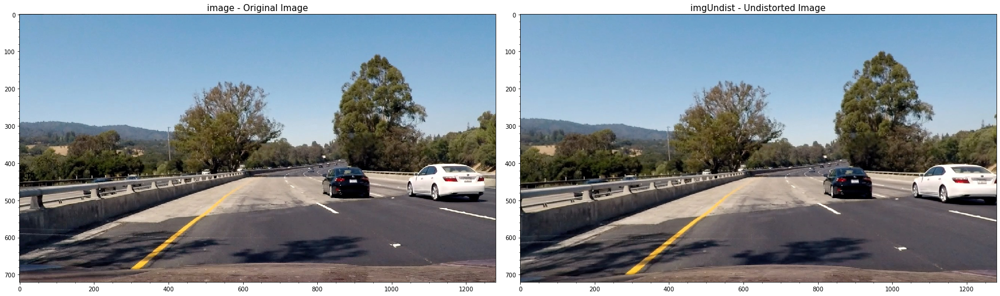
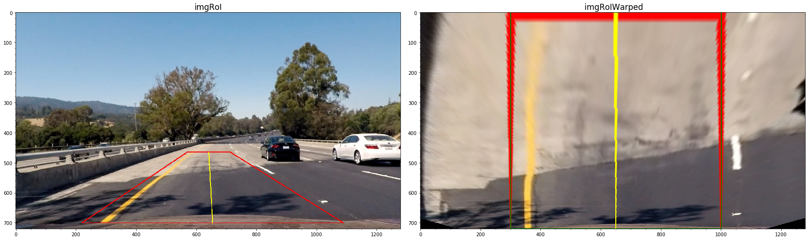
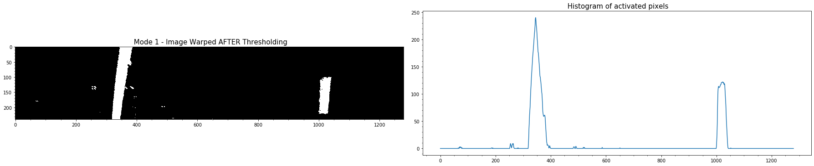
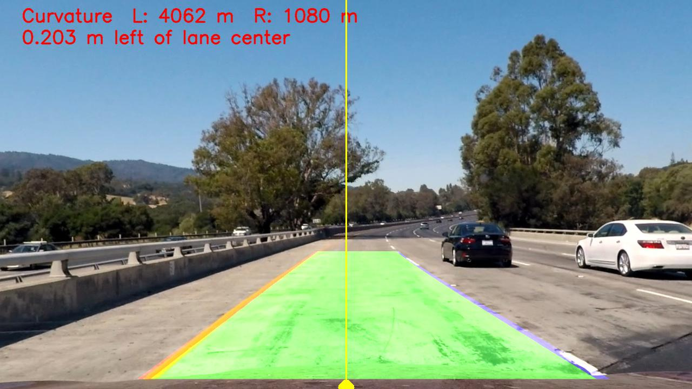
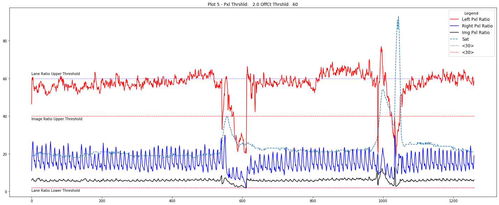
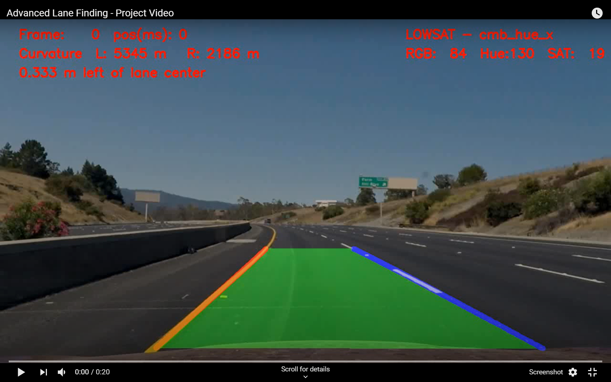
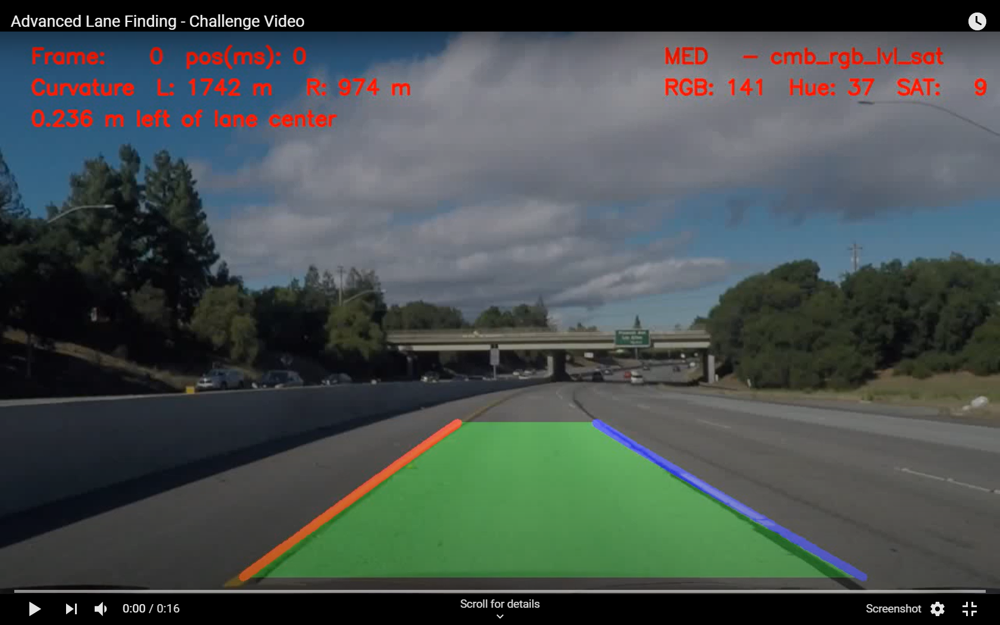
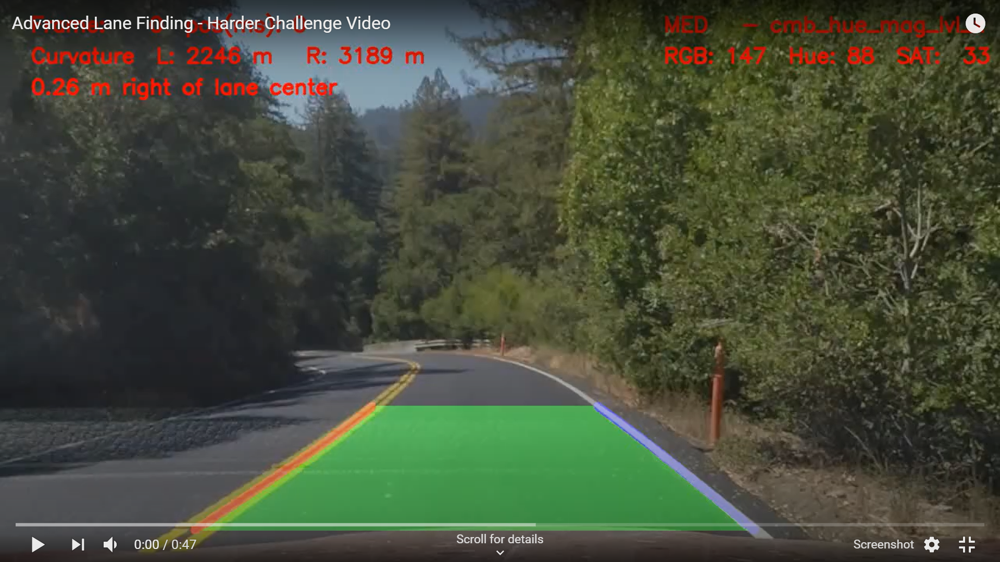

 
 
<!-- markdownlint-disable MD033 -->
<!-- <head> -->
<link rel="stylesheet"  href="markdown_styles.css">
<!-- </head> -->
<!-- @import "writeup_images/css/markdown-styles.css" -->
<!-- @import "writeup_images/css/main.css" -->
<!-- (setq markdown-xhtml-header-content) -->


# Advanced Lane Finding Project
### Project 2 - Udacity Self Driving Car Nanodegree 
#### Kevin Bardool

---

Project Goals:

* Compute the camera calibration matrix and distortion coefficients given a set of chessboard images.
* Apply a distortion correction to raw images.
* Use color transforms, gradients, etc., to create a thresholded binary image.
* Apply a perspective transform to rectify binary image ("birds-eye view").
* Detect lane pixels and fit to find the lane boundary.
* Determine the curvature of the lane and vehicle position with respect to center.
* Warp the detected lane boundaries back onto the original image.
* Output visual display of the lane boundaries and numerical estimation of lane curvature and vehicle position.

---

This writeup addresses the project specifications/requirements as laid out in the [Rubric Points](https://review.udacity.com/#!/rubrics/571/view) :

* [Camera Calibration : ](#camera-calibration) Review of the camera calibration process:  
* [Image Pipeline : ](#lane-detection-pipeline-single-images) Review of the detection pipeline for images 
* [Video Pipeline : ](#lane-detection-pipeline-video)Review of the detection pipeline for videos 
* [Discussion : ](#discussion) Reflection on work, challenges encountered, and  possible improvements.

The [Appendix](#appendix) contains additional information on certain code implementations.

---


## Camera Calibration
<br>

**1. Briefly state how you computed the camera matrix and distortion coefficients.**

Classes `Camera` and `CalibrationImage` were implemented for the camera and calibration images respectively. Code for these classes are located in `./classes/camera.py` and `./classes/image.py`
 
For each chessboard calibration image, an instance of the `CalibrationImage` is instantiated, and its `findChessboardCorners()` method is called. This function is basically a wrapper for the `cv2.findChessboardCorners()`, and also accepting `nx` and `ny` parameters that specify the chessboard dimensions. This allows changing the number of inside corners based on the individual calibration image.

This method prepares the  `objectPts` numpy array which contains the (x, y, z) coordinates of the chessboard corners in the real world (assuming the chessboard is fixed on the (x, y) plane at z=0).  The result of the corner detection, `imagePts`, is a `[nx, ny]` array of the (x, y) pixel position of each of the successfully detected corners in the chessboard image plane.

The code demonstrating the corner detection and computing the camera calibration parameters can be found in the `1-CameraCalibration` notebook.


#### Examples of successful corner detections:
 


#### Corner detection failures

The corner detection process was executed using the parameters `(nx,ny) = (9,6)` (number of horizontal and vertical corners). However, we observe that the corner detection fails for three chessboard images: `calibration1.jpg`, `calibration4.jpg`, and `calibration5.jpg`.

The openCV documentation states:
>The function requires white space (like a square-thick border, the wider the better) around the board to make the detection more robust in various environments. Otherwise, if there is no border and the background is dark, the outer black squares cannot be segmented properly and so the square grouping and ordering algorithm fails.

The three failed images are all missing a sufficient white border on two or more sides of the chessboard:
<br>
<p align="center">


</p>
<p align="center">Chessboard images with failed corner detection  from Left: calibration1, calibration4, and calibration5.</p>
<br>

It is possible to successfully run corner detection on these images when the `(nx,ny)` parameters are adjusted. For example, we can successfully detect corners for calibration5.png when we set (nx, ny) to (7, 6), as illustrated below: 

<br>
<p align="center">

</p>
<p align="center">Successful corner detection on <code>calibration5.jpg</code> when  (nx, ny) are set to (7,6)</p>
<br>


For the purposes of this project, we only include images in the calibration process that pass the corner detection process with (nx, ny) = (9, 6).

#### Camera Calibration 
Image objects that successfully pass the corner detection process are saved in a list and passed to the `camera.calibrate()` method. This method receives real world points `image.objPoints` and the equivalent image coordinates `image.imgPoints`  to compute the camera's calibration matrix and distortion coefficients as well as the rotation/translation vectors for each image. The camera calibration parameters are saved in a pickle file for future reference. 
 
Once the camera calibration matrix has been calculated, it is possible to undistort images - two examples of undistorted images are shown below:


 

<p align="center">Example of distortion-correction. &nbsp Left column: Original Images 
&nbsp &nbsp Right: Undistorted Image </p>
<br>
<br> 

## Lane Detection Pipeline (single images)


#### 1. Provide an example of a distortion-corrected image.

To apply distortion correction, the `undistortImage()` method of the camera object is invoked.

```python
        ###----------------------------------------------------------------------------------------------
        ###  Remove camera distortion and apply perspective transformation
        ###----------------------------------------------------------------------------------------------
        imgUndist = self.camera.undistortImage(imgInput)
```

<figure>


<p align="center">&nbsp &nbsp  Example of distortion-correction. &nbsp &nbsp Left column: Original Image &nbsp &nbsp  Right column: Undistorted Image</p>
</figure>
<br>
<br>

#### 2. Describe how (and identify where in your code) you used color transforms, gradients or other methods to create a thresholded binary image.  

A number of thresholding methods were implemented and experimented with in order to select a robust thresholded binary image that will work for most lighting combinations. 

*   X and Y Gradient 
*   Gradient Magnitude and Threshold
*   RGB Channel Thresholds (Channel AND and OR) 
*   Hue Thresholding (on image HLS format)
*   Level Thresholding (on image HLS format)
*   Saturation Thresholding (on image HLS format)

The code for these various thresholding methods can be found in <code class=redcode>./common/sobel.py</code>. I experimented with a number of other methods such as erosion, dilation, opening and closing however did not find them to improve the thresholding process significantly. 

<figure>

<p align="center">Example of various thresholding operations</p>
<figure>
<br>

To create the final thresholded image, we experimented creating a **compound** binary threshold image by combining various individual threshold operations. Eventually a combination of X Gradient, Gradient magnitude and direction, Saturation, and RGB levels was selected with the following threshold limits:

|  Point Location  |   Thresholding Limits (Min/Max)|
|:----------------:|:------------------------------:|
|  X Gradient      |  (30, 110)  |
|  Gradient Magnitude |  (65, 255)  |
|  Gradient Direction |  (40, 65)   (slope in degrees)  |
|  Saturation      |  (200,255)  |
|  RGB Levels      |  (210, 255) |

<br>
#### Provide examples of a binary image result.  
Images below demonstrate various combinations of compound binary thresholding operations.
<br>


<p align="center">Example of compound binary thresholds </p>
<br>

<p align="center">Binary thresholding using compound thresholds on RGB, saturation and gradient magnitude</p>
<br>


#### 3. Describe how (and identify where in your code) you performed a perspective transform

Perspective transformation is done in <code class=redcode>perspectiveTransform()</code> located in `./common/sobel.py` lines 18 to 28.  `perspectiveTransform()` takes receives source (`source`) and destination (`dest`) points, and the image to transform. It first calls `cv2.getPerspectiveTransform()` to obtain the transformation matrix `M`. Next, it calls `cv2.warpPerspective()` to apply the perspective transformation on the input image using the calculated transformation matrix.   


The exact coordinates of source and destination points used for the transformation were selected through a review of a number of test images, aiming to convert the converging lane lines to parallel lines post transformation. 

We ended up using the following source and destination points:

|  Point Location  |   Source    | Destination  | 
|:----------------:|:-----------:|:------------:| 
|  Top Left        |  570, 465   |  300, 0      | 
|  Top Right       |  714, 465   | 1000, 0      |
|  Bottom Right    | 1090, 700   | 960, 719     |
|  Bottom Left     |  220, 700   | 960, 719     |

The perspective transform was tested by drawing the `src` and `dst` points onto a test image and its warped counterpart to verify that the lines appear parallel in the warped image.

#### Example of a transformed image.



<p align="center">Example of perspective transformation</p>
<br>

#### 4. Describe how (and identify where in your code) you identified lane-line pixels and fit their positions with a polynomial?

<code class=redcode>sliding _window_detection_v1()</code> is the routine responsible for lane-pixel identification. This code is located in `classes/imagepipeline.py`, lines 385-555.  This function first generates a histogram of active pixels in the lower 1/3rd of the thresholded image. It then attmepts to detect the peak positions (counting the pixels per x position) and finds the x location corresponding to the peak positions located on the left and right of the x-axis midline.

 

<p align="center">Detecting activated pixels using histogram on the lower portion of the image.
<br>
<br>

The  and  positions are used as starting points in the sliding window algorithm we use to search for left and right lane pixels. The first windows are centered at  and , respectively. For each window, the non-zero pixels located within the window region are selected and counted.

```python
# Identify the nonzero pixels in x and y within each window.nonzerox and nonzeroy are the x,y # 
# coordiantes of all non-zero pixels in the binary thresholded image. 
left_x_inds = np.where((win_xleft_low <=  nonzerox) & (nonzerox < win_xleft_high))
left_y_inds = np.where((win_y_low     <=  nonzeroy) & (nonzeroy < win_y_high))
good_left_inds = np.intersect1d(left_x_inds,left_y_inds,assume_unique=False)

right_x_inds = np.where((win_xright_low <= nonzerox) & (nonzerox < win_xright_high))
right_y_inds = np.where((win_y_low     <=  nonzeroy) & (nonzeroy < win_y_high))
good_right_inds = np.intersect1d(right_x_inds,right_y_inds,assume_unique=False)
###------------------------------------------------------------------------------------
``` 

If the number of detected pixels within a window region is less than the `minpix` parameter, it is assumed that pixel detection for that window has failed. In this case the center position of the current window is reused for the next window iteration. Otherwise, detected pixels are appended to a list for further processing.

 An example of the sliding window process and detected lane pixels on the binary thresholded image is displayed below:


<p align="center">Example of lane pixel detection using the sliding window algorithm</p>
<br>
 
The X and Y coordinates of the selected pixels (red and blue pixels in image above) are the passed on to the line fitting process, <code class=redcode>fit_polynomial_v1</code> ( `classes/imagepipeline.py`, lines 558-572). This routine calls `np.polyfit` to fit a second degree polynomial over the detected pixels. 


<p align="center">Example of lane pixel detection and fitted polynomials</p>
<br>

#### 5.1 Describe how (and identify where in your code) you calculated the radius of curvature of the lanes.

For lane detection on images, radius of curvature calculation is performed in  <code class=redcode>calculate_radius()</code> ( `classes/imagepipeline.py`, lines 720-730):

```python
def calculate_radius(y_eval, fit_coeffs, units, MX_denom = 700, MY_denom = 720, debug = False):
    MY = 30/MY_denom # meters per pixel in y dimension
    MX= 3.7/MX_denom # meters per pixel in x dimension
    A,B,_ = fit_coeffs   
    if units == 'm':
        A = (A * MX)/ (MY**2)
        B = (B * MX/MY)
    
    return  ((1 + ((2*A*(y_eval*MY))+B)**2)** 1.5)/np.absolute(2*A) 
```

The curvature message displayed on the image is built in  <code class=redcode>curvatureMsg_V1()</code> ( `classes/imagepipeline.py`, lines 749-767)

**Note:** Radius of curvature for video frames are calculated using the same algorithm, but using numpy polynomial . See appendix A for more details

#### 5.2 Describe how (and identify where in your code) you calculated the position of the vehicle with respect to center.

The position of the vehicle with respect to the lane center is calculated in  <code class=redcode>offCenterMsg_V1()</code> (`classes/imagepipeline.py`, lines 688-718)

```python
def offCenterMsg_v1(y_eval, left_fitx, right_fitx, center_x, units = 'm', debug = False):
    '''
    Calculate position of vehicle relative to center of lane
    Original version used for Image Pipeline

    Parameters:
    -----------
    y_eval:                 y-value where we want radius of curvature
    left_fitx, right_fitx:  x_values at y_eval
    center_x:               center of image, represents center of vehicle
    units   :               units to calculate off_center distance in 
                            pixels 'p'  or meters 'm'
    '''
    
    mid_point  = left_fitx + (right_fitx - left_fitx)//2
    off_center_pxls = mid_point - center_x 
    off_center_mtrs = off_center_pxls * (3.7/700)
    
    oc = off_center_mtrs if units == 'm' else off_center_pxls
    
    if off_center_pxls != 0 :
        output = str(abs(round(oc,3)))+(' m ' if units == 'm' else ' pxls ')  +('left' if oc > 0 else 'right')+' of lane center'
    else:
        output = 'On lane center'
    
    return output ## round(off_center_mtrs,3), round(off_center,3)
```

<br>
#### 6. Provide an example image of your result plotted back down onto the road such that the lane area is identified clearly.

The code to plot / overlay the detected lanes back onto the image is implemented in <code class=redcode>displayDetectedRegion_v1()</code> (`classes/imagepipeline.py`, lines 634-684). The necessary overlay is constructed and added to the input image using `cv2.addWeighted()` function.  

<br>
<p align="center">


<br>
Results of lane detection over images test1 & test2
<br>
<br>


<br>
Results of lane detection over images test3 & test4
<br><br>


<br>
Results of lane detection over images test5 & test6
<br>
<br>
</p>
</div>

## Lane Detection Pipeline (video)

For the video stream lane detection, I started from the code base for image lane detection. A significant number of modifications and enhancements were made to the software. A detailed explanation of all enhancements would be beyond the brevity requirements of this report, so I will only discuss the most important points:


#### Significant Code Enhancements

- New `VideoPipeline` class: Pipeline class for video input. 

- New `Line` class: instantiated for left/right lane detection. Fitted polynomial attributes and methods during the video frame lanes detection process are implemented under this class.

- New `VideoFile` class: used to manage input/output video files. Instantiated twice per pipeline execution, for input and output files, respectively.

- Many of the functions written for the image lane detection were reimplemented to support the above mentioned classes.

- A series of "debug helpers" were written to tracking, verification, and troubleshooting purposes. 

- A series of visualization helper routines were written to research and tune the proper thresholding levels to be used in  dynamic frame thresholding. For example the Hue, Level, and Saturation rates of individual video frames (more below). 

#### Dynamic Binary Thresholding

 For binary thresholding of individual video frames, a dynamic thresholding approach was taken. Instead of a static thresholding method, the thresholding method used in each frame is determined based on the mean RGB and  average values of each frame extracted from the RGB and HLS images.

Here are the frame conditions, selection criteria, and the corresponding thresholding method for the project video. It is important to note that the original frame condition process was quite simple and consisted three conditions: `dark`, `low-saturation` and `normal`. As I worked on the more challenging videos encompassing a larger variety of lighting conditions, the selection process was expanded. 

As a frame is categorized, its corresponding thresholding method is applied and used for subsequent pipeline steps.  

|  Frame Condition   |  Mean RGB       | Saturation   | Binary Thresholding Method |
|:-------------------|:----------------:|:------------:|:-------------------:| 
|  X-High Saturation |    ---          | Sat >  120   |  magnitude / x gradient |  
|  High Saturation   |    ---          | Sat >  65    |  magnitude / x gradient |  
|  Low  Saturation   |    ---          | Sat <  20    |  hue / x gradient |  
|||||
|  X-High Mean RGB   |    RGB  > 180   |   ---        |  magnitude / x gradient |  
|  High / Med        | 100< RGB < 180  | 20< Sat < 65 |  RGB / Level / Saturation | 
|  Low               | 35 < RGB < 100  | 20< Sat < 65 |  magnitude / xy gradient | 
|  X-Low             | RGB  < 35       | 20< Sat < 65 |  magnitude / xy gradient |  


A wide variety of video frame color space statistics were investigated in order to select the proper thresholds and the corresponding binary thresholding method. Here is a sample plot from one of these experiments that plots the Hue, Level, Saturation, and Mean RGB of each frame of video clip.


<p align="center">


<br>
Video analysis plots. Top: Undistorted frames  - Bottom: Frames after perspective transformation
<br>
<br>
</p>


#### Assessment of detected lane pixels
`assess_lane_detections()` (lines 412-532 of `classes/videopipeline.py`) assesses the detected non-zero pixels detected in the binary thresholded image. It examines counts and ratios of the overall image as well as individual status for pixels detected for each lane.

##### Lane-level assessments:
- absolute count of non-zero pixels detected for each lane
- ratio of detected non-zero pixels to total pixels in lane search region

##### Frame-level checks:
- ratio of non-zero pixels to total pixels in image 
- ratio of detected non-zero pixels to total non-zero pixels in image 
- ratio of detected non-zero pixels to total non-zero pixels in search regions 
- number of non-zero pixels detected in lane search region to total number of 

These allow us to determine whether the detected pixels are reliable enough to use the fitted polynomials for lane detection. For example, if the image is over saturated, the ratio of non-zero pixels to total pixels and lane non-zero pixels to lane search pixels will be extremely high, and as a result the fitted polynomials cannot be relied upon.

<p align="center">

<br>
Pixel ratio analysis of video frames
<br><br>
</p>


#### Assessment of Fitted Polynomials
`assess_fitted_polynomials()` (lines 536-532 of `classes/videopipeline.py`) takes results of the detected pixels assessment (above) and other information related to the frame being processed, and makes a final determination whether to accept or reject the fitted polynomials. 

Based on the quality of the detected pixels in the image and fitted polynomials, the color of the inter-lane overlay is set to green, yellow, or red. 

- Green: frame produced acceptable detection pixels  and both lane polynomials were accepted. 
- Yellow: detection has low quality ( one or more polynomials were rejected or the frame detection has poor quality) 
- Red : We have encountered low quality lane detection for more than 25 frames. 
- no-display: no reliable lane detection could be ascertained. 

Examples of these overlays can be seen in the hard challenge video output.

#### Dynamic adjustment of perspective transformation points
Another part that was added during the work on the harder challenge video was the dynamic change of perspective transformation points. As we encounter curves in the road, the points selected for the perspective transformation drift away from the lanes we aim to detect, and we end up detecting other artifacts. To address this I implemented dynamic realignment of the perspective transformation points. This code for this is in `adjust_RoI_window` (lines 800-900 in ./classes/videopipeline.py).  

After each reliable lane detection we taken the top and bottom points on each lane and calculate the difference between them and the perspective transformation points. If the horizontal difference (along x axis) is larger than a preset threshold (`OFF_CENTER_ROI_THRESHOLD`) we adjust the source transformation points. This will be applied on the next and subsequent frames. Since we adjust the perspective transformation, we also set a flag to apply the sliding window detection algorithm on the next video frame. 


## Final video outputs 

 <br>

- [Project Video](https://youtu.be/zuZbICpFCIo)
<p align="center">
  <a href="https://www.youtube.com/watch?v=zuZbICpFCIo"></a>
</p>
 <br>

- [Challenge Video](https://youtu.be/RgM5bsvKJNM)

<p align="center">
  <a href="https://www.youtube.com/watch?v=RgM5bsvKJNM"></a>
</p>
 <br>

- [Hardest Challenge video](https://youtu.be/RgM5bsvKJNM)

<p align="center">
  <a href="https://youtu.be/UJN9KKazyLM"></a>
</p>

<br>

## Discussion     

In this section we discuss the approach taken in various phases of the project, challenges faced, and how these challenges were addressed. We will focus on the image and video lane detection, as the camera calibration portion was relatively straight-forward. 

I have discussed a number of approaches taken to address the video lane detection requirements as well as more challenging scene conditions in the previous section. 
<!-- Here I'll talk about the approach I took, what techniques I used, what worked and why, where the pipeline might fail and how I might improve it if I were going to pursue this project further.   -->


#### General Approach - Image detection pipeline

For image lane detection, an incremental code buildup approach was taken. 

The main work focused on building a basic detection pipeline and implementing the various processes required for the pipeline. A considerable amount of time was spent on identifying basic varying scene conditions. These varying conditions led to building a robust thresholding process (`apply_thresholds()` in `common/sobel.py`) that allows the application of multiple thresholding methods.  Various detection controls were parameterized, which allow testing and fine tuning the various detection processes.


A substantial number of helper routines were written visualize the results of the detection process at various points in the algorithm. For example, the `PlotDisplay` class (`classes/plotdisplay.py `). An instance of this class allows us to display a varying number of plots together without concerns about the necessary setups required for each individual plot.

#### General Approach - Video detection pipeline

During the image detection phase of the project, I did not implement a `Line` class to contain and organize the detected lane date and methods. This resulted in duplication of a number of functions that had to be rewritten during the video detection phase to use `Line` instances. 

For example, the original `sliding_window_detection_v1()` written for the image pipeline was duplicated for the video pipeline. I have refactored some of these duplicate functions but have left other due to the delays in submitting my project. I plan to refactor and consolidate these routines after project submission. 

The video detection process was able to successfully detect the basic project video easily. some minor challenges arised while attempting to process the challenge video. 

The main challenges were in successfully processing the harder_challenge video. It was this processing this video that brought about the more complex changes and additions to the video pipeline process. 

##### Thresholding of the perspective transformed images
Generally in the detection process we first apply binary thresholding and warp (apply perspective transformation) afterwards. 

I also experimented with the reverse order, that is, first warping the video frame, and applying binary thresholding to the warped image. In the case of the challenge videos, this actually provided very good results when the normal process encountered difficulties in lane detection due to various artifacts present in the image.

The detection algorithm allows selection of this processing method through the `process_mode` parameter. When `process_mode = 1` the normal process is followed: Each video frame is thresholded, and perspective transformation is applied on the resulting binary-thresholded image.

When `process_mode = 2' perspective transformation is applied to the input frame first. Binary thresholding is applied afterwards.


<p align="center">

<br>
Binary Thresholding results using different processing orders. Left Column: Perspective Transformation applied before binary thresholding.  Right Column: Perspective Transformation applied before binary thresholding.
<br><br>
</p>


#### Lane detection under adverse conditions 
One of the main challenges during the video lane detection process was adapting our algorithm for robustness towards varying road surface conditions, and extreme scene lighting conditions. 

For the challenge video, a relatively simple two-level conditional thresholding was introduced where each frame was categorized based on each frame's saturation conditions, and appropriate threshold levels were used for binary thresholding. 

For the harder challenge video, the simple two level thresholding scheme was no longer sufficient, and the conditional thresholding algorithm was expanded to achieve robustness towards  multiple lighting conditions, as describe in the video pipeline section.

Another issue was correctly recognizing lane markers when the road surface had other artifacts that could be easily confused with lane markers. To address this, we introduced detected lane quality assessment, which used simple statistical properties (which are also parameterized and adjustable) to verify whether the algorithm has been able to provide a valid, dependable connection. 


 #### Lane continuation and detection history

Another challenge was continuing the lane display if lane detection was unsuccessful for one or more video frames. In these situations, we expect the pipeline to fallback on previous detection information to display lane detections as long as it possibly can. 

To this goal we maintain a history of detected lane information (fitted polynomials, x/y coordinates, etc...). If the detection algorithm is unable to predict one or both lanes with a minimum level of confidence, it will revert to the kept history to provide an estimated lane detection. If the algorithm is unable to confidently detect lanes for a number of frames, the color in the inter-lane region is changed from green to yellow and eventually red to indicate the reduced quality of lane detections. 

One important point is the length of the lane detection history. In each frame a "best_fit" polynomial is computed based on the average of the most recent polynomial fit and the  best_fit polynomial history. 

In the for the project and  challenge video a history of around eight frames proved to be robust to smoothen out any non-detected frame or swings in the fitted polynomial. 

However, this history length proved problematic when processing the harder challenge video. This was due to the rapid and successive twists and turns in the road, which in essence would render detection information from older frames less important. I attempted to use a weighted averaging among the history which did not yield satisfactory results. In the end, I used a shorter history for computing the best_fit polynomial in the harder challenge video. 

Another possible option to address this would be to allow a dynamic selection of the number of previous fitted polynomials to be used during the best_fit polynomial computation. This could possibly be tied to road conditions such as radius of curvature history. as the radius decreases - meaning a sharper curve in the road - the algorithm could reduce the number of previous fits in the best-fit polynomial computation. 


 #### Challenging scenarios when lane detection may fail.  What could be done to make it more robust?

Under extremely over- or under-saturated conditions as some intervals in the harder challenging video, line detection fails due to the absence of any discernable lane in the image. Additionally in adverse weather conditions where the road surface is covered with ice or snow, or blizzard conditions where visibility is severely reduced, our algorithm will fail to detect lane markers.

To improve robustness more sophisticated lane continuation approaches should be considered, where in addition to the detection history other factors such as close-by vehicles, sign postings and traffic lights, and road surface vs. non-road surface segmentation are take into account. A learning algorithm could be trained to determine optimal threshold parameters based on the image color level, hue and saturation characteristics. 


## Conclusion

For me this project was an extremely enlightening experience. I spent more than %60 of my time on implementing and testing various approaches to achieve very good lane detection results on the **harder_challenge_video** .  

The project It allowed me to reflect on the various difficulties we face when attempting to use classical computer vision techniques for challenging vision tasks. Many of such solutions  revert to hand-crafted and elaborately fine-tuned feature detection/extraction algorithms which while may be sufficient enough for one task (e.g. project video0) require additional crafting and fine-tuning for slightly different tasks (e.g. the harder challenge video).

This is one of the main advantages of deep learning based solutions: removing the tedious task of feature selection and extraction from the shoulders of the computer vision practitioner.

<br>
### Appendicies
#### A - Computation of lane curvatures

As mentioned in the course material, our polynomial fitting process fits the  of detected pixels, solving for , determining the coefficients for the following function.

<!-- $$ f(y) = x = Ay^2 + By + C $$ 
 -->
<p align="center">
<a href="https://www.codecogs.com/eqnedit.php?latex=f(y)&space;=&space;x&space;=&space;Ay^2&space;&plus;&space;By&space;&plus;&space;C" target="_blank"></a>
</p>

The radius of the curvature is defined as:

<!-- $$  R_{curve} = \frac{{[1+ {(\frac{dx}{dy})}^2]}^{\frac{3}{2}}}{|\frac{d^2x}{dy^2}|}
$$ -->

<p align="center">
<a href="https://www.codecogs.com/eqnedit.php?latex=R_{curve}&space;=&space;\frac{{[1&plus;&space;{(\frac{dx}{dy})}^2]}^{\frac{3}{2}}}{|\frac{d^2x}{dy^2}|}" target="_blank"></a>
</p>
where :

<!-- $$$ \large\frac{dx}{dy} = f'(y) = 2Ay+B \qquad \qquad \frac{d^2x}{dy^2} = f''(y) = 2A $$$ -->
<p align="center">
<a href="https://www.codecogs.com/eqnedit.php?latex=\large\frac{dx}{dy}&space;=&space;f'(y)&space;=&space;2Ay&plus;B&space;\qquad&space;\qquad&space;\frac{d^2x}{dy^2}&space;=&space;f''(y)&space;=&space;2A" target="_blank"></a>
</p>

Therefore the radius of curvature can be computed as :

<!-- $$  \large R_{curve} = \frac{{[1+ f'(y)^2]}^{\frac{3}{2}}}{|2f''(y)|}  $$ -->
<p align="center">
<a href="https://www.codecogs.com/eqnedit.php?latex=\large&space;R_{curve}&space;=&space;\frac{{[1&plus;&space;f'(y)^2]}^{\frac{3}{2}}}{|2f''(y)|}" target="_blank"></a>
</p>

Note that the C coefficient has no effect on the radius of the curvature.
Considering that the (x, y) coordinates used in polynomal fitting are in pixels, and we want to display the radius of curvature in meters, we convert the equation into meters by replacing <a href="https://www.codecogs.com/eqnedit.php?latex=x_{pixel}" target="_blank"></a> and <a href="https://www.codecogs.com/eqnedit.php?latex=y_{pixel}" target="_blank"></a> with <a href="https://www.codecogs.com/eqnedit.php?latex=x_{meter}" target="_blank"></a> and <a href="https://www.codecogs.com/eqnedit.php?latex=y_{meter}" target="_blank"></a>:

<!-- $$ \qquad \qquad \qquad \large x_{pixel} = \frac{x_{meter}}{MX}  \qquad \qquad  y_{pixel} = \frac{x_{meter}}{MY} $$ -->
<p align="center">
<a href="https://www.codecogs.com/eqnedit.php?latex=\qquad&space;\qquad&space;\qquad&space;\large&space;x_{pixel}&space;=&space;\frac{x_{meter}}{MX}&space;\qquad&space;\qquad&space;y_{pixel}&space;=&space;\frac{x_{meter}}{MY}" target="_blank"></a>
</p>

The polynomial becomes:

<!-- ```math
 \large \frac{x_{meter}}{MX} = A{(\frac{y_{meter}}{MY})}^2 + B(\frac{y_{meter}}{MY}) + C
 ``` -->
<p align="center">
<a href="https://www.codecogs.com/eqnedit.php?latex=\large&space;\frac{x_{meter}}{MX}&space;=&space;A{(\frac{y_{meter}}{MY})}^2&space;&plus;&space;B(\frac{y_{meter}}{MY})&space;&plus;&space;C" target="_blank"></a>
</p>

solving for \(x_{meter}\):

<!-- $$ \large  x_{meter} = {(A*\frac{MX}{MY^2})}y_{meter}^2 + (B*\frac{MX}{MY})y_{meter} + C $$ -->
<p align="center">
<a href="https://www.codecogs.com/eqnedit.php?latex=\large&space;x_{meter}&space;=&space;{(A*\frac{MX}{MY^2})}y_{meter}^2&space;&plus;&space;(B*\frac{MX}{MY})y_{meter}&space;&plus;&space;C" target="_blank"></a>
</p>


And we use the <a href="https://www.codecogs.com/eqnedit.php?latex=x_{meter}" target="_blank"></a> defined above to compute the radius in meters.

The implemented code is `get_radius()` (lines 204-238 in ./classes/line.py).   :

```python

def get_radius(self, fit_parms = None, y_eval = 0, debug = False):
        
        y_eval_MY      = y_eval * self.MY
        exponents      = np.arange(self.poly_deg,-1,-1)
        MY_factors     = np.power((1.0 / self.MY), exponents)
        fit_parms_mod  = fit_parms * MY_factors * self.MX

        firstDerivParms  = np.polyder(fit_parms_mod, 1)
        firstDeriv_eval  = np.polyval(firstDerivParms, y_eval_MY )
        secondDerivParms = np.polyder(fit_parms_mod, 2)
        secondDeriv_eval = np.polyval(secondDerivParms, y_eval_MY)

        if np.all(secondDerivParms == np.zeros_like(secondDerivParms)) :
            # print( ' second deriv is zero ')
            cur_radius = np.ones_like(y_eval) * 6000
        else:
            cur_radius = ((1 + (firstDeriv_eval)**2)** 1.5)/np.absolute(secondDeriv_eval) 

        cur_radius = np.clip(cur_radius, 0, 6000).tolist()
        
        return np.round(cur_radius,2) 
```
<br>

As mentioned previously, for lane detection on **images**, radius of curvature is calculated in  <code class=redcode>calculate_radius()</code> (`common/imagepipeline.py`, lines 720-730):


```python
def calculate_radius(y_eval, fit_coeffs, units, MX_denom = 700, MY_denom = 720, debug = False):
    MY = 30/MY_denom # meters per pixel in y dimension
    MX= 3.7/MX_denom # meters per pixel in x dimension
    A,B,_ = fit_coeffs   
    if units == 'm':
        A = (A * MX)/ (MY**2)
        B = (B * MX/MY)
    
    return  ((1 + ((2*A*(y_eval*MY))+B)**2)** 1.5)/np.absolute(2*A) 
```

[//]: # (Image References)
<!-- [image1]: ./examples/undistort_output.png "Undistorted"
[image2]: ./test_images/test1.jpg "Road Transformed"
[image3]: ./examples/binary_combo_example.jpg "Binary Example"
[image4]: ./examples/warped_straight_lines.jpg "Warp Example"
[image5]: ./examples/color_fit_lines.jpg "Fit Visual"
[image6]: ./examples/example_output.jpg "Output"
[video1]: ./project_video.mp4 "Video"
[image01]: ./camera_cal/calibration1.jpg "calibration1 image"
[image02]: ./camera_cal/calibration4.jpg "calibration4"
[image03]: ./camera_cal/calibration5.jpg "calibration5"
[image04]: ./writeup_images/detectcorners2.png "detectcorner2"
[image05]: ./writeup_images/detectcorners3.png "detectcorner3"
[image06]: ./writeup_images/undistorted2.png "undistorted2"
[image07]: ./writeup_images/undistorted3.png "undistorted3" -->
